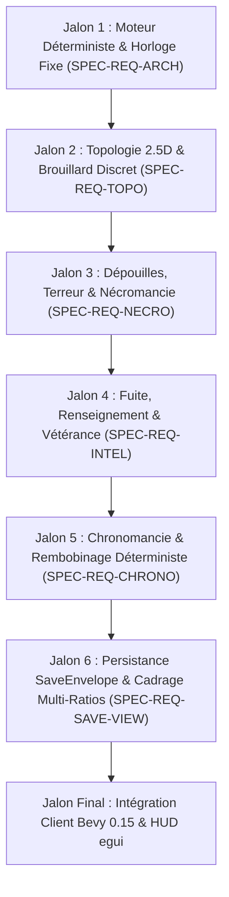

# Feuille de Route Ingénierie & Matrice de Traçabilité TDD

| Métadonnée | Valeur |
| :--- | :--- |
| **Projet** | *Tomb of Heroes: Tactical Keep Master* |
| **Méthodologie** | Spec-Driven Development (SDD) & Test-Driven Development (TDD) |
| **Règle Fondamentale** | **Tout test doit être écrit en ROUGE avant toute ligne d'implémentation métier.** |
| **Cadre de validation** | Tests headless unitaires et d'intégration purs dans `tomb_of_heroes_core`. |

---

## Vue d'ensemble des Jalons de Développement



---

## Jalon 1 (M1) : Fondations Déterministes, Horloge Fixe & Arithmétique Entière

### Traçabilité Spécification
* `SPEC-REQ-ARCH-001` : Cycle d'Horloge Fixe (Fixed-Tick 20 Hz).
* `SPEC-REQ-ARCH-002` : Arithmétique Entière & Points de Base ($10\,000 = 100,00\,\%$).
* `SPEC-REQ-ARCH-003` : Isolation des Identifiants Stables (`LogicId(u64)`).
* `SPEC-REQ-ARCH-004` : Flots PRNG Déterministes Découplés (`Xoshiro256PlusPlus`).
* `SPEC-REQ-ARCH-005` : Empreinte Cryptographique d'État (`StateHash`).

### Contrat d'Interface Attendu
```rust
pub struct Tick(pub u64);
pub struct LogicId(pub u64);
pub struct BasisPoints(pub u32);
pub struct StateHash(pub u64);

pub fn apply_bps(value: u32, bps: BasisPoints) -> u32;
pub fn div_bps(numerator: u32, denominator: u32) -> Result<BasisPoints, MathError>;

pub struct LogicIdGenerator { /* séquentiel u64 */ }
pub struct DeterministicRngBank { /* gestion des canaux RngStreamKind */ }
```

### Matrice TDD — Tests Unitaires & Intégration Headless (à écrire en ROUGE)
1. `tests/m1_arch/test_tick_advancement.rs` :
   - Initialiser l'horloge logique à `Tick(0)`.
   - Exécuter 10 pas de simulation successifs.
   - Vérifier l'assertion stricte `clock.current_tick() == Tick(10)`.
2. `tests/m1_arch/test_basis_points_rounding.rs` :
   - Tester les valeurs exactes : $1\,000 \times 10\,000 \text{ BPS} = 1\,000$.
   - Tester l'arrondi au plus proche : $250 \times 1\,500 \text{ BPS} = 38$.
   - Tester l'arrondi sur tiers : $333 \times 3\,333 \text{ BPS} = 111$.
3. `tests/m1_arch/test_logic_id_monotonicity.rs` :
   - Allouer $10\,000$ identifiants consécutifs.
   - Vérifier qu'aucun identifiant n'est dupliqué et que $\text{id}_{n+1} == \text{id}_n + 1$.
4. `tests/m1_arch/test_prng_stream_isolation.rs` :
   - Tirer $500$ valeurs sur le canal `Combat`.
   - Constater que le canal `DungeonGen` produit la même séquence exacte qu'un générateur vierge.
5. `tests/m1_arch/test_state_hash_repeatability.rs` :
   - Exécuter une même séquence de commandes sur 2 instances distinctes du moteur.
   - Vérifier l'égalité bit-à-bit des deux `StateHash`.

### Cas Limites & Invariants d'Erreur (Edge Cases)
1. `test_basis_points_overflow_near_u32_max` : Vérifier que `apply_bps(u32::MAX, BasisPoints(10_000))` ne panique pas grâce à la promotion intermédiaire en `u64`.
2. `test_division_by_zero_clamping` : Vérifier que `div_bps(100, 0)` renvoie `Err(MathError::DivisionByZero)` sans panique.
3. `test_logic_id_overflow_guard` : Vérifier que le générateur rejette l'allocation si `u64::MAX` est atteint.

---

## Jalon 2 (M2) : Topologie Discrète 2.5D, Shadowcasting & Carte Mentale

### Traçabilité Spécification
* `SPEC-REQ-TOPO-001` : Représentation Discrète 2.5D Multi-Étages.
* `SPEC-REQ-TOPO-002` : Connecteurs Verticaux Orientés (Escaliers, Trappes, Chutes).
* `SPEC-REQ-TOPO-003` : Ligne de Vue Discrète (Recursive Shadowcasting par Pentes Rationnelles).
* `SPEC-REQ-TOPO-004` : Carte Mentale des Héros (`HeroKnowledgeMap`).
* `SPEC-REQ-TOPO-005` : Algorithme d'Exploration par Frontière.

### Contrat d'Interface Attendu
```rust
pub struct FloorId(pub u8);
pub struct GridCoord { pub x: i32, pub y: i32 }
pub struct WorldCoord { pub floor: FloorId, pub coord: GridCoord }

pub enum VerticalLinkKind {
    Stairs,
    Ladder,
    Pitfall,
    OneWayPortal,
}

pub struct HeroKnowledgeMap { /* tri-state: Unexplored, Explored, InSight */ }
pub fn compute_shadowcasting_fov(origin: GridCoord, radius: u32, grid: &DungeonGrid) -> HashSet<GridCoord>;
pub fn evaluate_exploration_frontiers(knowledge: &HeroKnowledgeMap, squad_pos: GridCoord) -> Option<GridCoord>;
```

### Matrice TDD — Tests Unitaires & Intégration Headless (à écrire en ROUGE)
1. `tests/m2_topo/test_metric_distances.rs` :
   - Tester Manhattan et Chebyshev sur des paires de points orthogonaux et diagonaux avec coordonnées négatives.
2. `tests/m2_topo/test_shadowcasting_occlusion.rs` :
   - Créer une salle $10 \times 10$ avec un pilier opaque central en $(3, 3)$.
   - Calculer le FOV depuis $(1, 1)$. Vérifier que $(4, 4)$ et $(5, 5)$ sont ombrés, mais que $(3, 2)$ et $(2, 3)$ sont éclairés.
3. `tests/m2_topo/test_semi_opaque_attenuation.rs` :
   - Placer une nappe de brume semi-opaque (pénalité de 3 tuiles).
   - Vérifier que la portée restante au-delà de la brume est réduite exactement de 3 tuiles.
4. `tests/m2_topo/test_vertical_transition_pitfall_one_way.rs` :
   - Valider la traversée de $(0, (5, 5))$ vers $(1, (5, 5))$.
   - Rejeter la traversée inverse avec `Err(NavigationError::PassageUnidirectional)`.
5. `tests/m2_topo/test_knowledge_map_fog_transitions.rs` :
   - Un déplacement fait passer des tuiles de `Unexplored` à `InSight`.
   - Sortir du champ de vision bascule les tuiles en `Explored`.
6. `tests/m2_topo/test_frontier_selection_utility.rs` :
   - Vérifier que la fonction d'utilité priorise la frontière la plus proche exempte de terreur.

### Cas Limites & Invariants d'Erreur (Edge Cases)
1. `test_fov_grid_boundaries_no_panic` : Observer depuis le bord $(-128, -128)$ sans débordement de mémoire tampon.
2. `test_frontier_exhaustion_returns_none` : Quand le niveau est entièrement exploré, `evaluate_exploration_frontiers` retourne `None`.
3. `test_door_state_discrepancy_rediscovery` : Vérifier l'invalidation d'un chemin mémorisé dès qu'une porte close rentre dans le champ `InSight`.

---

## Jalon 3 (M3) : Dépouilles, Terreur Systémique & Nécromancie Asymétrique

### Traçabilité Spécification
* `SPEC-REQ-NECRO-001` : Cycle de Vie des Dépouilles (`Intact`, `Damaged`, `Destroyed`).
* `SPEC-REQ-NECRO-002` : Jauge de Terreur et Seuils de Panique.
* `SPEC-REQ-NECRO-003` : Nécromancie Asymétrique (Joueur vs Clergé).
* `SPEC-REQ-NECRO-004` : Empilement de Cadavres et Explosion Macabre.

### Contrat d'Interface Attendu
```rust
pub enum CorpseState { Intact, Damaged, Destroyed }
pub struct Corpse { /* corpse_id, source_hero_id, structural_hp, state, terror_potency */ }
pub struct TerrorPoints(pub u32);
pub struct Bravery(pub BasisPoints);

pub enum PanicLevel { Serene, Shaken, Disrupted, BlindPanic }
pub fn compute_terror_accumulation(distance: u32, potency: BasisPoints, bravery: Bravery) -> u32;
pub fn raise_undead(corpse: &mut Corpse, kind: UndeadKind, available_mana: u32) -> Result<UndeadMinion, NecroError>;
pub fn sanctify_corpse(corpse: &mut Corpse) -> Result<(), NecroError>;
```

### Matrice TDD — Tests Unitaires & Intégration Headless (à écrire en ROUGE)
1. `tests/m3_necro/test_corpse_spawn_on_kill.rs` :
   - Infliger des dégâts létaux à un aventurier.
   - Vérifier qu'une entité `Corpse` `Intact` est générée sur la tuile exacte avec $50 \text{ HP}$ structurels.
2. `tests/m3_necro/test_terror_accumulation_by_distance.rs` :
   - Placer un novice ($2\,000 \text{ BPS}$ de bravoure) à distance 1 d'un cadavre.
   - Constater une accumulation plus rapide qu'à distance 4, conformément à la formule exacte.
3. `tests/m3_necro/test_panic_level_transitions.rs` :
   - Vérifier les transitions aux seuils : $3\,000$ (`Shaken`), $6\,000$ (`Disrupted`), $8\,500$ (`BlindPanic`).
4. `tests/m3_necro/test_raise_skeleton_consumes_corpse.rs` :
   - Exécuter la réanimation sur un corps `Intact` avec $40 \text{ Mana}$.
   - Constater la génération du squelette et le passage du cadavre en `Destroyed`.
5. `tests/m3_necro/test_cleric_sanctification.rs` :
   - Exécuter `sanctify_corpse`. Constater que le cadavre devient `Destroyed` et sanctifié.
   - Tenter ensuite une réanimation : rejet strict avec `Err(NecroError::CorpseSanctified)`.

### Cas Limites & Invariants d'Erreur (Edge Cases)
1. `test_corpse_stack_slide_at_capacity_3` : Faire mourir 4 héros sur la même case $(2, 2)$ : vérifier que le 4ème corps glisse sur une case libre adjacente.
2. `test_corpse_falling_into_pitfall` : Mourir sur une case de trappe ouverte entraîne la chute du corps à l'étage inférieur avec perte de HP structurels.
3. `test_terror_clamp_at_10_000` : Vérifier qu'une exposition prolongée ne dépasse jamais le plafond absolu de $10\,000 \text{ BPS}$.

---

## Jalon 4 (M4) : Procédure de Retraite, Renseignement de la Guilde & Vétérance

### Traçabilité Spécification
* `SPEC-REQ-INTEL-001` : Déclencheurs de Retraite et Comportement de Fuite.
* `SPEC-REQ-INTEL-002` : Contre-Mesures (Herses et Ancres Dimensionnelles).
* `SPEC-REQ-INTEL-003` : Registre de Renseignement de la Guilde & Dissipation.
* `SPEC-REQ-INTEL-004` : Système de Vétérance et Réapparition Revancharde.

### Contrat d'Interface Attendu
```rust
pub enum SquadState { Incursion, Combat, Retreat }
pub struct GuildIntelRegister { /* dalles connues, pièges identifiés, indices de fraîcheur */ }
pub struct IntelConfidence(pub BasisPoints);
pub struct VeteranProfile { /* veteran_id, rank, survived_incursions, trauma_traits */ }

pub fn should_squad_retreat(squad: &Squad) -> bool;
pub fn merge_intel_on_escape(guild_intel: &mut GuildIntelRegister, hero_map: &HeroKnowledgeMap);
pub fn dissipate_guild_intel(guild_intel: &mut GuildIntelRegister, elapsed_ticks: u64);
```

### Matrice TDD — Tests Unitaires & Intégration Headless (à écrire en ROUGE)
1. `tests/m4_intel/test_retreat_trigger_on_casualties.rs` :
   - Créer une escouade de 4 héros. Tuer 2 membres ($50\%$).
   - Constater que les survivants passent en `SquadState::Retreat` et se dirigent vers l'entrée.
2. `tests/m4_intel/test_portcullis_blocking.rs` :
   - Abaisser une herse sur la trajectoire d'un groupe en fuite.
   - Constater l'obligation de forcer la herse ($100 \text{ ticks}$) ou de trouver un détour.
3. `tests/m4_intel/test_intel_transfer_on_escape.rs` :
   - Un héros s'échappe par la sortie : vérifier que la Guilde intègre ses tuiles explorées à $10\,000 \text{ BPS}$ de confiance.
4. `tests/m4_intel/test_intel_temporal_dissipation.rs` :
   - Avancer de 5 jours de simulation ($120\,000 \text{ ticks}$).
   - Vérifier la baisse linéaire exacte de l'indice de confiance.
5. `tests/m4_intel/test_veteran_trait_generation.rs` :
   - Un héros ayant subi de violents dégâts de feu avant de fuir acquiert `TraumaTrait::Pyrophobia`.

### Cas Limites & Invariants d'Erreur (Edge Cases)
1. `test_hero_killed_at_exit_threshold_cancels_intel` : Un coup fatal reçu au moment exact du passage de sortie interdit tout enregistrement à la guilde.
2. `test_false_confidence_trap_penalty_application` : Modifier l'emplacement d'un piège mémorisé par la guilde inflige le malus de $-3\,000 \text{ BPS}$ de détection.
3. `test_guild_roster_overflow_eviction_policy` : Insérer 33 vétérans successifs : la liste est maintenue à 32 avec éviction du profil le plus faible/ancien.

---

## Jalon 5 (M5) : Chronomancie, Event Sourcing, Rembobinage & Paradoxes

### Traçabilité Spécification
* `SPEC-REQ-CHRONO-001` : Modèle Event Sourcing (`ActionJournal`).
* `SPEC-REQ-CHRONO-002` : Instantanés Périodiques & Algorithme de Rembobinage Déterministe.
* `SPEC-REQ-CHRONO-003` : Conscience Temporelle & Mémoire Résiduelle (`ChronoMemory`).

### Contrat d'Interface Attendu
```rust
pub struct TimedCommand { pub tick: Tick, pub command_id: LogicId, pub payload: CoreCommand }
pub struct ActionJournal { /* append-only log */ }
pub struct StateSnapshot { /* image complète déterministe */ }
pub struct SnapshotRingBuffer { /* capacité: 12 instantanés */ }
pub struct ChronoMemory { pub anticipated_hazards: HashSet<WorldCoord> }

pub fn execute_rewind(
    world: &mut LogicWorld,
    journal: &mut ActionJournal,
    snapshots: &SnapshotRingBuffer,
    target_tick: Tick,
) -> Result<(), ChronoError>;
```

### Matrice TDD — Tests Unitaires & Intégration Headless (à écrire en ROUGE)
1. `tests/m5_chrono/test_action_journal_ordering.rs` :
   - Injecter des commandes avec des ticks différents et identiques.
   - Vérifier l'ordonnancement strict par `(tick, command_id)`.
2. `tests/m5_chrono/test_snapshot_capture_cadence.rs` :
   - Exécuter $350 \text{ ticks}$ de simulation.
   - Constater la présence d'instantanés aux ticks $100$, $200$ et $300$.
3. `tests/m5_chrono/test_deterministic_rewind_replay.rs` :
   - Sauvegarder le `StateHash` au tick $120$.
   - Continuer la simulation jusqu'au tick $200$ en modifiant l'état.
   - Rembobiner au tick $120$ : prouver que `world.state_hash() == original_hash_120`.
4. `tests/m5_chrono/test_rewind_mana_cost.rs` :
   - Vérifier le prélèvement de $20 + (80 \times 500 / 10\,000) = 24 \text{ Mana}$ pour un rembobinage de 80 ticks.
5. `tests/m5_chrono/test_chrono_aware_adaptation.rs` :
   - Déclencher un piège mortel dans le futur.
   - Rembobiner : l'inquisiteur temporel doté de `ChronoAwareness` refuse de marcher sur la tuile du piège.

### Cas Limites & Invariants d'Erreur (Edge Cases)
1. `test_rewind_past_oldest_snapshot_error` : Rembobiner au tick 20 quand le plus vieil instantané est à 100 retourne `Err(ChronoError::SnapshotExpired)`.
2. `test_rewind_with_zero_mana_fails` : Empêcher le rembobinage et préserver l'état intact en cas de mana insuffisant.
3. `test_future_command_truncation` : Après un rembobinage au tick 120, aucune commande de tick 130 ne doit subsister dans l'`ActionJournal`.

---

## Jalon 6 (M6) : Persistance SaveEnvelope, Compression & Cadrage Multi-Ratios

### Traçabilité Spécification
* `SPEC-REQ-SAVE-001` : Structure Binaire de l'Enveloppe (`SaveEnvelope` TOHS + zstd + CRC32).
* `SPEC-REQ-SAVE-002` : Encodage d'Exportation Base64.
* `SPEC-REQ-VIEW-001` : Zone de Sécurité 2D (Safe Zone $320 \times 240$) & Ratios d'Aspect ($4:3$ à $21:9$).
* `SPEC-REQ-VIEW-002` : Mise à l'Échelle Pixel-Perfect (Integer Scaling).

### Contrat d'Interface Attendu
```rust
#[repr(C)]
pub struct SaveHeader {
    pub magic: [u8; 4],
    pub format_version: u16,
    pub flags: u16,
    pub campaign_id: [u8; 16],
    pub save_tick: u64,
    pub uncompressed_size: u32,
    pub compressed_size: u32,
    pub payload_crc32: u32,
    pub state_hash: u64,
}

pub struct SaveEnvelope { pub header: SaveHeader, pub compressed_payload: Vec<u8> }
pub fn pack_save_envelope(world: &LogicWorld) -> Result<SaveEnvelope, SaveError>;
pub fn unpack_save_envelope(envelope: &SaveEnvelope) -> Result<LogicWorld, SaveError>;
pub fn export_to_base64_string(envelope: &SaveEnvelope) -> String;
pub fn import_from_base64_string(armored_text: &str) -> Result<SaveEnvelope, SaveError>;

pub fn compute_pixel_perfect_scale(screen_w: u32, screen_h: u32, target_w: u32, target_h: u32) -> u32;
```

### Matrice TDD — Tests Unitaires & Intégration Headless (à écrire en ROUGE)
1. `tests/m6_save/test_save_header_binary_size.rs` :
   - Vérifier `std::mem::size_of::<SaveHeader>() == 48` (ou layout spécifié exact).
2. `tests/m6_save/test_save_envelope_roundtrip.rs` :
   - Instancier un monde complet, l'empaqueter en `SaveEnvelope`, puis le réouvrir.
   - Vérifier l'égalité de tous les champs et du `StateHash`.
3. `tests/m6_save/test_crc32_corruption_detection.rs` :
   - Corrompre un bit dans le payload zstd.
   - Vérifier le rejet immédiat avec `Err(SaveError::CrcMismatch)`.
4. `tests/m6_save/test_base64_armor_export_import.rs` :
   - Exporter une enveloppe en texte blindé Base64, la réimporter et vérifier l'identité stricte.
5. `tests/m6_save/test_pixel_perfect_scale_calculation.rs` :
   - Écran $1920 \times 1080$ $\to$ Échelle entière $4\times$.
   - Écran $2560 \times 1440$ $\to$ Échelle entière $6\times$.
   - Écran $800 \times 480$ $\to$ Échelle entière $2\times$.

### Cas Limites & Invariants d'Erreur (Edge Cases)
1. `test_corrupt_magic_bytes_rejected` : Rejeter un fichier dont l'en-tête ne commence pas par `b"TOHS"`.
2. `test_empty_payload_handled_gracefully` : Rejeter un fichier tronqué sans panique d'indexation mémoire.
3. `test_viewport_aspect_ratio_narrower_than_4_3` : Sur ratio $1:1$, forcer le pillarboxing pour que la Safe Zone $320 \times 240$ reste intacte.
