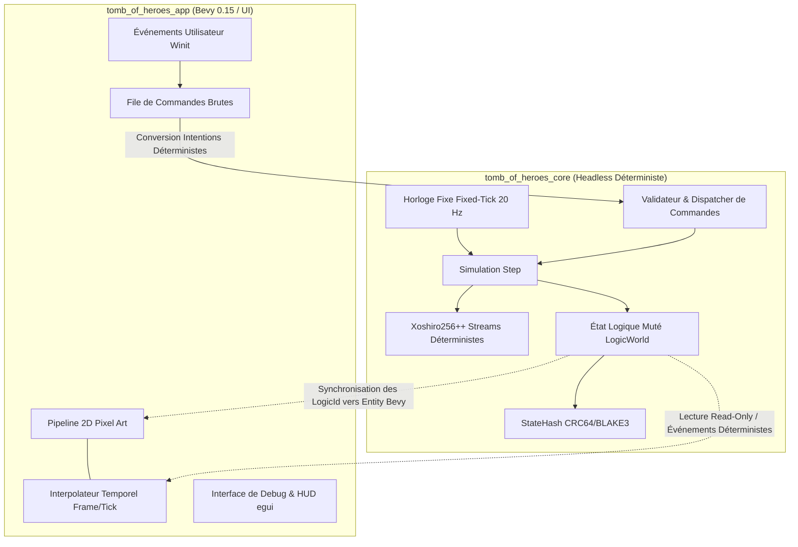

# Spécification Technique 01 — Architecture & Déterminisme

| Métadonnée | Valeur |
| :--- | :--- |
| **Identifiant Domaine** | `SPEC-DOMAIN-ARCH` |
| **Statut** | Validé / Source Unique de Vérité |
| **Auteur** | Ingénieur Système & Architecte Logiciel |
| **Version** | 1.0.0 |
| **Cible d'implémentation** | `crates/tomb_of_heroes_core` (Headless pur) & `crates/tomb_of_heroes_app` |

---

## 1. Vue d'ensemble architecturale

Le moteur de *Tomb of Heroes* repose sur une scission stricte en deux couches découplées :
1. **Core Domaine (`tomb_of_heroes_core`) :** Moteur headless pur, déterministe, exempt de toute dépendance graphique, sonore ou d'entrée/sortie non synchrone. Il gère l'état logique, les règles de simulation, l'arbre de décision et la persistance.
2. **Conteneur Applicatif (`tomb_of_heroes_app`) :** Application hôte propulsée par Bevy 0.15, responsable de l'affichage 2D pixel-art, de l'interpolation temporelle de rendu, du mixage audio et de la capture des événements tactiles/souris via `bevy_egui`.



---

## 2. Exigences Spécifiées

### `SPEC-REQ-ARCH-001` : Cycle d'Horloge Fixe (Fixed-Tick Simulation)
* **Description :** L'intégralité de la logique de simulation progresse par pas discrets constants. Aucun calcul logique ne doit dépendre du `delta_time` variable de la boucle de rendu Bevy.
* **Fréquence nominale :** $20 \text{ Hz}$, soit $\Delta t_{\text{logic}} = 50 \text{ ms}$ ($50\,000 \mu\text{s}$) par tick.
* **Compteur d'horloge :** Type `Tick(u64)`, démarrant à `Tick(0)` à l'initialisation du donjon, incrémenté de façon strictement monotone :
  $$\text{Tick}_{n+1} = \text{Tick}_n + 1$$
* **Accumulateur temporel :** Le conteneur Bevy accumule le temps physique écoulé et invoque le pas logique autant de fois que requis (avec un plafond anti-spirale de la mort fixé à 5 ticks consécutifs par frame de rendu).

### `SPEC-REQ-ARCH-002` : Arithmétique Entière & Points de Base (Zero-Float Policy)
* **Description :** Pour garantir la reproductibilité multi-plateforme stricte (x86_64, ARM64 iOS/Android, WASM) et empêcher les divergences IEEE-754 :
  * Aucun type flottant (`f32`, `f64`) n'est autorisé dans `tomb_of_heroes_core`.
  * Tout pourcentage, ratio de dégâts, probabilité, multiplicateur ou coefficient de dissipation est exprimé sous forme de **points de base** (BPS, *basis points*) où :
    $$10\,000 \text{ BPS} = 100,00\,\% \quad \Longleftrightarrow \quad 1 \text{ BPS} = 0,01\,\%$$
* **Opérations Arithmétiques Déterministes :**
  * Multiplication d'une valeur entière $V$ par un facteur en points de base $B$ avec arrondi au plus proche (*round-half-up*) :
    $$\text{apply\_bps}(V, B) = \left\lfloor \frac{V \times B + 5\,000}{10\,000} \right\rfloor$$
    *Note d'implémentation :* Le produit intermédiaire $V \times B$ doit être promu en `u64` ou `i64` pour prévenir tout débordement de capacité sur un multiplicande `u32`.
  * Division entière sécurisée :
    $$\text{div\_bps}(N, D) = \begin{cases} 
      \left\lfloor \frac{N \times 10\,000 + (D / 2)}{D} \right\rfloor & \text{si } D > 0 \\
      0 & \text{si } D = 0 \text{ (avec log d'anomalie invariant)}
    \end{cases}$$

### `SPEC-REQ-ARCH-003` : Isolation des Identifiants Stables (`LogicId` vs `Entity` Bevy)
* **Problématique :** Les identifiants internes de Bevy (`bevy::ecs::entity::Entity`) sont basés sur une allocation d'index de slot et un numéro de génération dépendant de l'ordre d'exécution mémoire et du multithreading. Ils ne sont ni stables, ni sérialisables de façon déterministe entre différentes machines ou après un rembobinage.
* **Solution imposée :**
  * Le domaine logique alloue exclusivement des `LogicId(pub u64)`.
  * L'allocation suit un générateur interne séquentiel et déterministe :
    $$\text{LogicId}_{n+1} = \text{LogicId}_n + 1 \quad (\text{avec } \text{LogicId}_0 = 1)$$
  * La couche `tomb_of_heroes_app` maintient une table de correspondance bidirectionnelle `EntityMapping` :
    $$\text{EntityMapping} : \text{LogicId} \longleftrightarrow \text{bevy::ecs::entity::Entity}$$
  * Lors de la destruction logique d'un agent, l'événement `LogicDespawn(LogicId)` notifie Bevy qui procède au despawn visuel de l'`Entity` correspondante.

### `SPEC-REQ-ARCH-004` : Flots PRNG Déterministes Découplés
* **Algorithme imposé :** `rand_xoshiro::Xoshiro256PlusPlus`.
* **Graines & Découplage des flux :**
  * Une graine maîtresse `DungeonMasterSeed(u64)` initialise le donjon.
  * Pour éviter qu'un tirage cosmétique ou une décision IA mineure ne désynchronise le calcul de combat ou la génération procédurale, des canaux PRNG indépendants sont instanciés :
    1. `RngStream::DungeonGen` : Génération des étages, disposition des salles et pièges.
    2. `RngStream::Combat` : Jets de toucher, dispersion des dégâts, jets de terreur.
    3. `RngStream::AiDecisions` : Choix d'exploration sur les chemins à coût égal.
    4. `RngStream::LootAndDecay` : Tables de butin et dégradation des cadavres.

### `SPEC-REQ-ARCH-005` : Empreinte Cryptographique d'État (`StateHash`)
* À chaque fin de tick ou lors de la sauvegarde, le Core calcule une signature d'état `StateHash(pub u64)` sur l'ensemble des données critiques ordonnées.
* Tout écart de `StateHash` entre deux exécutions d'une même séquence de commandes signale immédiatement une rupture de déterminisme.

---

## 3. Schéma des Types de Données (Contrats Formels)

```rust
// Représentation conceptuelle des signatures de types pour tomb_of_heroes_core

#[derive(Debug, Clone, Copy, PartialEq, Eq, PartialOrd, Ord, Hash)]
pub struct Tick(pub u64);

#[derive(Debug, Clone, Copy, PartialEq, Eq, PartialOrd, Ord, Hash)]
pub struct LogicId(pub u64);

#[derive(Debug, Clone, Copy, PartialEq, Eq, PartialOrd, Ord, Hash)]
pub struct BasisPoints(pub u32); // Invariant : 0 <= val <= 100_000 (tolérance surcharges 1000%)

#[derive(Debug, Clone, PartialEq, Eq)]
pub enum RngStreamKind {
    DungeonGen,
    Combat,
    AiDecisions,
    LootAndDecay,
}
```

---

## 4. Matrice de Test-Driven Development (TDD)

### Cas de Test Nominaux à écrire en Rouge
1. `test_tick_increment_progression` : Vérifier que chaque appel au step de simulation incrémente le tick de façon unitaire et monotone.
2. `test_basis_points_apply_exactness` :
   - Calculer $250 \times 1\,500 \text{ BPS}$ ($15,00\,\%$) $\to 38$.
   - Calculer $1\,000 \times 10\,000 \text{ BPS}$ ($100,00\,\%$) $\to 1\,000$.
   - Calculer $333 \times 3\,333 \text{ BPS}$ $\to 111$.
3. `test_logic_id_allocation_determinism` : Deux instances initialisées avec la même graine doivent allouer des séquences de `LogicId` strictement identiques.
4. `test_prng_stream_isolation` : Vérifier que consommer $1\,000$ valeurs sur `RngStream::AiDecisions` ne modifie en rien la séquence générée par `RngStream::Combat`.

### Cas Limites & Invariants d'Erreur (Edge Cases)
1. `test_basis_points_overflow_protection` : Tester `apply_bps(u32::MAX, 10_000)` sans panique ni overflow arithmétique.
2. `test_division_by_zero_clamping` : Tester `div_bps(100, 0)` retournant `0` et consignant un code d'erreur de sécurité sans provoquer de crash.
3. `test_determinism_across_100k_ticks` : Rejouer un journal de 100 000 commandes et vérifier l'égalité bit-à-bit du `StateHash` final.
