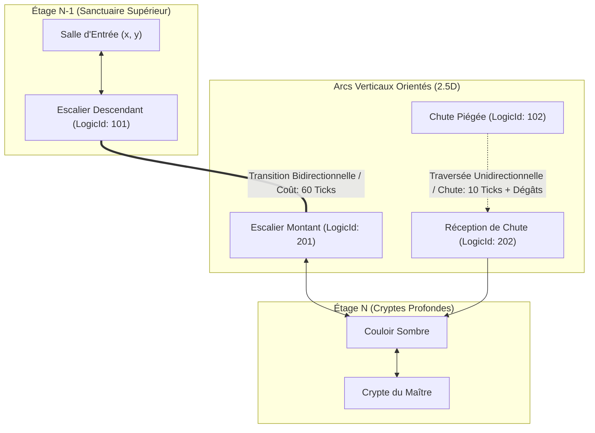
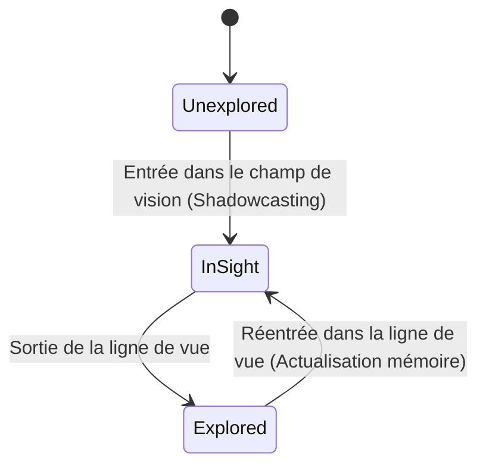

# Spécification Technique 02 — Topologie & Brouillard de Guerre

| Métadonnée | Valeur |
| :--- | :--- |
| **Identifiant Domaine** | `SPEC-DOMAIN-TOPO` |
| **Statut** | Validé / Source Unique de Vérité |
| **Auteur** | Ingénieur Système & Architecte Logiciel |
| **Version** | 1.0.0 |
| **Cible d'implémentation** | `crates/tomb_of_heroes_core` (Module `topology`) |

---

## 1. Vue d'ensemble du Modèle Spatial

Le donjon de *Tomb of Heroes* n'est pas un plan euclidien continu, mais un graphe discrétisé 2.5D combinant :
1. Des grilles 2D discrètes par étage (coordonnées entières signées).
2. Des arcs verticaux orientés modélisant les liaisons entre étages (escaliers, trappes, chutes).
3. Un modèle de vision discret par masquage d'ombres (*Shadowcasting*) sans interpolation flottante.
4. Une structure cognitive asymétrique (`HeroKnowledgeMap`) distinguant l'état réel du donjon de la représentation mentale des aventuriers.



---

## 2. Exigences Spécifiées

### `SPEC-REQ-TOPO-001` : Représentation Discrète 2.5D Multi-Étages
* **Coordonnées spatiales :**
  ```rust
  #[derive(Debug, Clone, Copy, PartialEq, Eq, PartialOrd, Ord, Hash)]
  pub struct FloorId(pub u8); // 0 = Entrée supérieure, index croissant vers les profondeurs

  #[derive(Debug, Clone, Copy, PartialEq, Eq, PartialOrd, Ord, Hash)]
  pub struct GridCoord {
      pub x: i32,
      pub y: i32,
  }

  #[derive(Debug, Clone, Copy, PartialEq, Eq, PartialOrd, Ord, Hash)]
  pub struct WorldCoord {
      pub floor: FloorId,
      pub coord: GridCoord,
  }
  ```
* **Distance discrète (Manhattan vs Chebyshev) :**
  * Pour le déplacement orthogonal pur (4 directions) :
    $$D_{\text{Manhattan}}(A, B) = |A.x - B.x| + |A.y - B.y|$$
  * Pour le calcul de portée de vision et des auras (8 directions) :
    $$D_{\text{Chebyshev}}(A, B) = \max(|A.x - B.x|, |A.y - B.y|)$$
  * Distance euclidienne approchée entière (pour les rayons d'explosion radiaux) :
    $$\text{dist\_sq}(A, B) = (A.x - B.x)^2 + (A.y - B.y)^2 \le R^2$$

### `SPEC-REQ-TOPO-002` : Connecteurs Verticaux Orientés
* Chaque transition verticale relie un `WorldCoord` source à un `WorldCoord` destination.
* **Typologie des transitions et invariants directionnels :**
  * `VerticalLinkKind::Stairs` : Bidirectionnel (montée / descente autorisée). Traversée nominale : $40 \text{ ticks}$ ($2,0 \text{ s}$).
  * `VerticalLinkKind::Ladder` : Bidirectionnel. Traversée lente : $80 \text{ ticks}$ ($4,0 \text{ s}$). Vulnérabilité aux attaques augmentée de $2\,500 \text{ BPS}$ ($+25\%$).
  * `VerticalLinkKind::Pitfall` (Trappe / Fosse) : **Strictement unidirectionnel descendant**. Traversée instantanée : $5 \text{ ticks}$. Dégâts de chute appliqués à l'arrivée :
    $$\text{fall\_damage} = \text{base\_fall\_dmg} \times \Delta \text{Floor} \times (10\,000 - \text{acrobatics\_bps}) / 10\,000$$
  * `VerticalLinkKind::OneWayPortal` : Unidirectionnel magique. Traversée : $10 \text{ ticks}$.

### `SPEC-REQ-TOPO-003` : Ligne de Vue Discrète (Recursive Shadowcasting)
* **Algorithme imposé :** Balayage en 8 octants par secteurs angulaires rationnels (pentes entières $dy / dx$), interdisant tout calcul trigonométrique flottant.
* **Structure d'un secteur angulaire :**
  ```rust
  #[derive(Debug, Clone, Copy, PartialEq, Eq)]
  pub struct RationalSlope {
      pub num: i32, // dy
      pub den: i32, // dx (den > 0)
  }
  ```
* **Propriétés de blocage de tuile :**
  * `TileOpacity::Transparent` : Laisse passer la lumière et les projectiles (dalles, eau peu profonde).
  * `TileOpacity::Opaque` : Bloque la ligne de vue (murs rocheux, herses pleines abaissées, portes blindées closes).
  * `TileOpacity::SemiOpaque` : Réduit la portée restante de $3 \text{ tuiles}$ (brume nécrotique dense, toiles d'araignées géantes).
* **Portée maximale :** Fixée par la torche ou perception de l'aventurier (ex: `VisionRadius(pub u32) = 8 tuiles`). Au-delà, la tuile est invisible même en ligne directe.

### `SPEC-REQ-TOPO-004` : Carte Mentale des Héros (`HeroKnowledgeMap`)
* Les héros ne disposent pas d'un accès omniscient au donjon. Chaque groupe d'aventuriers maintient une structure partagée de mémoire spatiale.
* **États cognitifs par tuile :**
  1. `TileVisibility::Unexplored` : Jamais observée. Le pathfinding de l'IA ignore l'existence de cette cellule.
  2. `TileVisibility::Explored` : Observée par le passé mais hors du champ de vision actuel. L'IA suppose que la géométrie statique (murs, portes) est inchangée, mais ignore si un piège a été armé ou si un monstre s'y tient.
  3. `TileVisibility::InSight` : Actuellement visible. Entités, pièges détectés et cadavres sont mis à jour en temps réel.
* **Désynchronisation cognitive :** Si le Maître du Donjon active une herse ou déploie un piège dans une tuile `Explored` (non visible), l'aventurier conserve sa croyance erronée jusqu'à ce que la tuile rentre à nouveau dans son champ `InSight`.



### `SPEC-REQ-TOPO-005` : Algorithme d'Exploration par Frontière
* **Définition de cellule frontière :** Une tuile $C$ est dite *frontière* si :
  1. $C$ est franchissable (*passable*).
  2. $C \in \text{Explored}$.
  3. Il existe au moins une tuile voisine $V \in \text{Unexplored}$ qui soit potentiellement franchissable.
* **Fonction d'utilité discrète pour le choix de la prochaine frontière :**
  Pour un groupe d'aventuriers situé en $P$, le score d'intérêt $S(F)$ d'une frontière $F$ est calculé en points de base :
  $$S(F) = U_{\text{base}} - \left( D_{\text{Manhattan}}(P, F) \times W_{\text{dist}} \right) - \left( \text{TerrorMiasma}(F) \times W_{\text{terror}} \right) + \left( \text{RoomAreaHeuristic}(F) \times W_{\text{room}} \right)$$
  *Poids nominaux :* $W_{\text{dist}} = 150 \text{ BPS/tuile}$, $W_{\text{terror}} = 200 \text{ BPS/point}$, $W_{\text{room}} = 50 \text{ BPS/tuile}$.
* **Recherche de chemin :** Algorithme A* discrètement optimisé s'exécutant exclusivement sur le sous-graphe des tuiles $\text{Explored} \cup \text{InSight}$. Si le chemin est bloqué par une porte fermée, le groupe tente une action de crochetage/enfoncement ou recalcule vers la frontière suivante.

---

## 3. Matrice de Test-Driven Development (TDD)

### Cas de Test Nominaux à écrire en Rouge
1. `test_manhattan_and_chebyshev_distance` :
   - Distance entre $(0, 0)$ et $(5, 3)$ $\to$ Manhattan = $8$, Chebyshev = $5$.
   - Distance avec coordonnées négatives $(-4, 2)$ et $(1, -3)$ $\to$ Manhattan = $10$, Chebyshev = $5$.
2. `test_shadowcasting_symmetric_vision` : Une colonne opaque en $(2, 2)$ bloque la vision d'un observateur en $(0, 0)$ vers $(3, 3)$ et $(4, 4)$, mais permet de voir $(2, 1)$ et $(1, 2)$.
3. `test_vertical_transition_one_way_pit` :
   - Traversée descendante autorisée : de $(0, (5, 5))$ vers $(1, (5, 5))$.
   - Tentative de traversée ascendante : retour immédiat d'une erreur `Err(NavigationError::PassageUnidirectional)`.
4. `test_hero_knowledge_map_fog_transition` :
   - Déplacement d'un héros révélant un rayon de 8 tuiles.
   - Recul du héros : les tuiles précédemment visibles passent à l'état `Explored`.
5. `test_frontier_selection_picks_closest_unexplored` : Vérifier que l'algorithme de frontière sélectionne la tuile non explorée la plus proche en l'absence de terreur.

### Cas Limites & Invariants d'Erreur (Edge Cases)
1. `test_shadowcasting_bounds_overflow` : Ligne de vue calculée au bord strict de la grille $(-128, -128)$ sans panique d'indexation.
2. `test_frontier_exhaustion_all_tiles_explored` : Lorsque toutes les cellules accessibles sont `Explored`, l'algorithme retourne `Ok(FrontierState::FullyExplored)` et déclenche le repli vers la sortie.
3. `test_door_state_discrepancy_on_rediscovery` : Un aventurier planifie un chemin à travers une porte mémorisée comme `Open`. Pendant son trajet dans le brouillard, la porte est fermée à clé par le joueur. À son arrivée en champ `InSight`, l'invalidation déclenche un recalcul d'A* immédiat.
