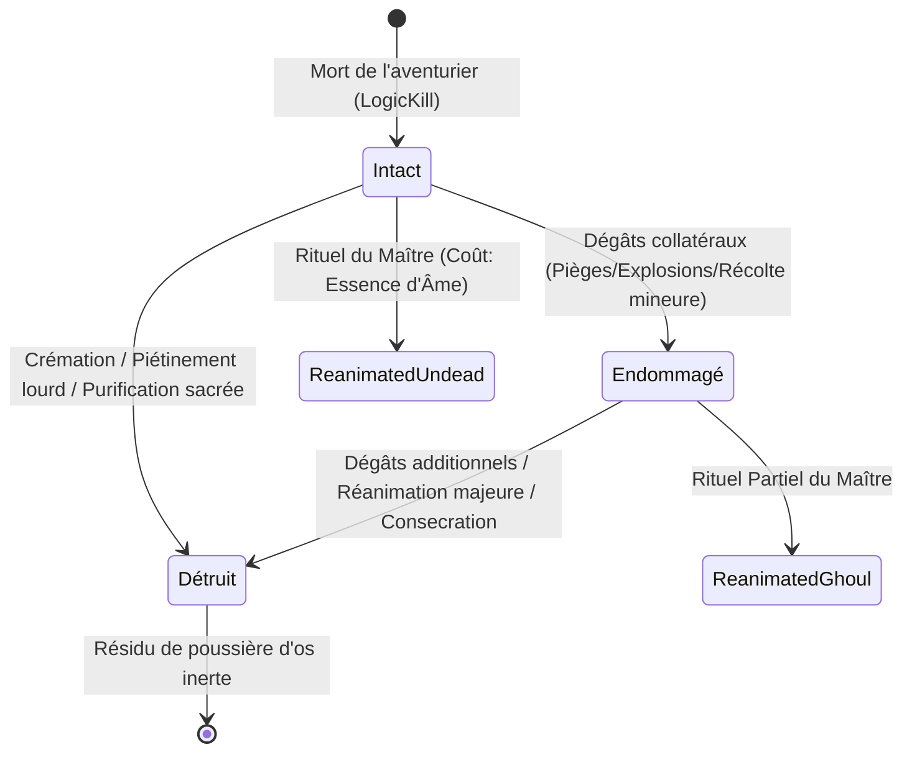

# Spécification Technique 03 — Cadavres, Terreur & Nécromancie Asymétrique

| Métadonnée | Valeur |
| :--- | :--- |
| **Identifiant Domaine** | `SPEC-DOMAIN-NECRO` |
| **Statut** | Validé / Source Unique de Vérité |
| **Auteur** | Ingénieur Système & Architecte Logiciel |
| **Version** | 1.0.0 |
| **Cible d'implémentation** | `crates/tomb_of_heroes_core` (Modules `corpse`, `terror`, `necromancy`) |

---

## 1. Vue d'ensemble du Système

Dans *Tomb of Heroes*, la mort d'un aventurier ou d'un serviteur n'est pas une simple suppression d'entité :
1. Elle génère une entité physique permanente `Corpse` dotée d'une intégrité structurelle et d'une puissance nécrotique/traumatique.
2. La présence de dépouilles altère l'état psychologique des vivants via un système de **Terreur systémique**, pouvant précipiter la déroute des recrues inexpérimentées.
3. Les dépouilles constituent une ressource stratégique disputée de manière **asymétrique** entre le Maître du Donjon (qui les réanime en serviteurs morts-vivants) et le Clergé/Paladins des aventuriers (qui les purifient ou les consument pour priver le joueur de matière première).



---

## 2. Exigences Spécifiées

### `SPEC-REQ-NECRO-001` : Cycle de Vie et Propriétés des Dépouilles
* **Structure formelle de données :**
  ```rust
  #[derive(Debug, Clone, Copy, PartialEq, Eq)]
  pub enum CorpseState {
      Intact,     // Chair et squelette préservés (100% de rendement nécrotique)
      Damaged,    // Tête broyée ou membres manquants (50% de rendement nécrotique)
      Destroyed,  // Cendres, os broyés, matière inerte (inutilisable)
  }

  #[derive(Debug, Clone, PartialEq, Eq)]
  pub struct Corpse {
      pub corpse_id: LogicId,
      pub source_hero_id: LogicId,
      pub hero_class: HeroClass,
      pub state: CorpseState,
      pub structural_hp: u32,             // HP restant du corps (Nominal: 50 HP)
      pub soul_essence_value: u32,        // Essence récoltable (Points entiers)
      pub base_terror_potency: BasisPoints, // Terreur projetée (BPS)
      pub decay_ticks_remaining: u32,     // Compteur avant putréfaction avancée
  }
  ```
* **Dégradation et dommages aux cadavres :**
  * Tout piège physique (broyeur, lame tranchante) ou attaque de zone affectant la tuile du cadavre inflige des dégâts à son `structural_hp`.
  * Si $\text{structural\_hp} \le 25$ : l'état passe d'`Intact` à `Damaged`.
  * Si $\text{structural\_hp} == 0$ : l'état passe à `Destroyed`.

### `SPEC-REQ-NECRO-002` : Jauge de Terreur et Seuils de Panique des Aventuriers
* **Résolution psychologique :**
  Chaque aventurier vivant possède un attribut de bravoure de base `Bravery(pub BasisPoints)` (où $10\,000 = \text{Bravoure Absolue}$) et une jauge d'effroi courante `TerrorPoints(pub u32)` plafonnée à $10\,000$.
* **Projection de terreur par un cadavre :**
  Un cadavre visible en ligne directe (`InSight`) dans un rayon $R \le 5 \text{ tuiles}$ inflige à chaque tick de présence :
  $$\Delta \text{Terror} = \left\lfloor \frac{\text{base\_terror\_potency} \times (6 - D_{\text{Chebyshev}})}{5 \times 20} \right\rfloor \times \frac{10\,000 - \text{Bravery}}{10\,000}$$
  *(Le facteur 20 correspond aux 20 ticks par seconde pour lisser l'accumulation).*
* **Pondération par classe et vétérance :**
  * Novice (Niveau 1) : $\text{Bravery} = 2\,000 \text{ BPS}$ ($20\%$). Très vulnérable.
  * Guerrier Endurci (Niveau 3) : $\text{Bravery} = 6\,500 \text{ BPS}$ ($65\%$).
  * Inquisiteur Vétéran : $\text{Bravery} = 9\,500 \text{ BPS}$ ($95\%$). Immunité quasi-totale.
* **Seuils d'altération du comportement :**
  1. `TerrorPoints < 3_000` : **Serein** (Comportement tactique standard).
  2. `3_000 <= TerrorPoints < 6_000` : **Ébranlé (Shaken)** :
     - Malus de précision et d'armure de $-1\,500 \text{ BPS}$ ($-15\%$).
     - Vitesse de déplacement diminuée de $1\,000 \text{ BPS}$ ($-10\%$).
  3. `6_000 <= TerrorPoints < 8_500` : **Déstabilisé (Disrupted)** :
     - Impossibilité d'incanter des sorts complexes.
     - Tendance à prioriser la retraite plutôt que l'objectif principal.
  4. `TerrorPoints >= 8_500` : **Panique Aveugle (Rout)** :
     - Perte totale du contrôle de formation.
     - L'aventurier fuit en ligne droite opposée à la source de terreur.
     - Probabilité par seconde de $3\,000 \text{ BPS}$ ($30\%$) de lâcher son arme principale au sol.

### `SPEC-REQ-NECRO-003` : Nécromancie Asymétrique (Joueur vs Héros)

#### A. Rituels du Maître du Donjon (Joueur)
* Le joueur peut cibler un cadavre dans sa zone d'influence et consommer du Mana Sombre pour invoquer une abomination :
  * **Squelette Gardien :** Requiert `state == Intact || state == Damaged`. Consomme $40 \text{ Mana}$. Donne naissance à un combattant rapide mais fragile.
  * **Zombie Mur-de-Chair :** Requiert `state == Intact`. Consomme $60 \text{ Mana}$. Sacrifie la vitesse pour un réservoir de PV massif et une aura de terreur résiduelle.
  * **Spectre d'Âme Déchue :** Consomme un cadavre `Intact` d'un héros de classe Magique. Génère une unité intangible capable de traverser les portes blindées.
* **Postcondition :** Lors de l'invocation, le cadavre source passe à l'état `Destroyed` ou est immédiatement désalloué du monde logique.

#### B. Rituels Sacrés des Aventuriers (Clercs / Paladins)
* Si un groupe d'aventuriers comporte un Clerc ou un Paladin disposant de charges de Foi :
  * Dès qu'un cadavre allié ou ennemi est visible et qu'aucune menace immédiate n'est au corps-à-corps, le Clerc entame un canal de sanctification `PurifyCorpse` ($60 \text{ ticks} = 3 \text{ s}$).
  * À la fin de la canalisation : le cadavre est réduit en cendres sacrées (`CorpseState::Destroyed`), neutralisant la source de terreur et interdisant toute réanimation future par le joueur.
  * Si la sanctification est interrompue par des dégâts subis : l'action est annulée sans dépense de Foi.

### `SPEC-REQ-NECRO-004` : Empilement et Destruction Préventive
* **Capacité maximale par tuile :** Un maximum de 3 cadavres peut coexister sur une même case $(x, y)$. Tout cadavre additionnel est rejeté par glissement (*sliding*) sur la case adjacente libre la plus proche.
* **Destruction préventive par le joueur :** Le joueur peut sacrifier un cadavre `Intact` via le sortilège *Explosion Macabre* :
  $$\text{Dégâts} = 80 \text{ HP Tranchants} + 2\,000 \text{ BPS de Terreur instantanée}$$
  dans un rayon Chebyshev de 2 tuiles. Le cadavre est instantanément `Destroyed`.

---

## 3. Matrice de Test-Driven Development (TDD)

### Cas de Test Nominaux à écrire en Rouge
1. `test_corpse_creation_on_hero_death` : La mort d'un héros génère un `Corpse` d'état `Intact` à la coordonnée exacte du trépas avec les HP structurels nominaux.
2. `test_terror_accumulation_by_proximity` : Un novice à 1 tuile d'un cadavre accumule plus de terreur par seconde qu'un novice situé à 4 tuiles.
3. `test_panic_state_triggers_flee_behavior` : Un héros atteignant $8\,500 \text{ TerrorPoints}$ bascule son état IA en `AiState::PanicFlee` et fuit la case de la dépouille.
4. `test_necromantic_raise_skeleton_consumes_corpse` : L'activation de la compétence de réanimation déduit les points de mana et bascule le cadavre en `Destroyed`.
5. `test_cleric_sanctification_prevents_raise` : Un cadavre ayant reçu le statut sanctifié ne peut plus être ciblé par une réanimation nécromantique (retour d'erreur `Err(NecroError::CorpseSanctified)`).

### Cas Limites & Invariants d'Erreur (Edge Cases)
1. `test_corpse_tile_stacking_overflow` : Empiler 4 cadavres consécutifs sur la même case $(5, 5)$ : vérifier que le 4ème est déplacé sur une tuile voisine franchissable valide.
2. `test_corpse_falling_into_chute` : Si un héros meurt sur une trappe ouverte `VerticalLinkKind::Pitfall`, son cadavre doit chuter à l'étage inférieur et subir des dégâts structurels de chute.
3. `test_terror_cap_cannot_exceed_10k` : Exposer un aventurier à 10 cadavres simultanés pendant 10 000 ticks : vérifier que `TerrorPoints` reste strictement clampé à $10\,000$.
