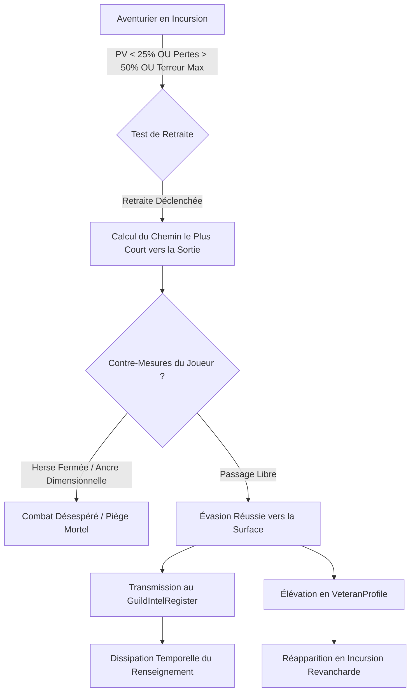

# Spécification Technique 04 — Fuite, Renseignement & Vétérance

| Métadonnée | Valeur |
| :--- | :--- |
| **Identifiant Domaine** | `SPEC-DOMAIN-INTEL` |
| **Statut** | Validé / Source Unique de Vérité |
| **Auteur** | Ingénieur Système & Architecte Logiciel |
| **Version** | 1.0.0 |
| **Cible d'implémentation** | `crates/tomb_of_heroes_core` (Modules `flee`, `intel`, `veterancy`) |

---

## 1. Vue d'ensemble du Système

La dynamique de *Tomb of Heroes* s'articule autour de la gestion asymétrique de l'information et des conséquences persistantes de la survie :
1. Les aventuriers ne combattent pas jusqu'au dernier souffle par défaut : ils évaluent continuellement leur survie et déclenchent une **procédure de retraite tactique**.
2. Tout aventurier qui parvient à s'échapper du donjon transmet l'intégralité de sa carte mentale au **Registre de Renseignement de la Guilde** (`GuildIntelRegister`), réduisant le brouillard de guerre des futures incursions.
3. Les survivants acquièrent de la **vétérance**, adaptent leur équipement aux pièges découverts et peuvent réapparaître en tant que chefs d'expédition revanchards (*Némésis*).



---

## 2. Exigences Spécifiées

### `SPEC-REQ-INTEL-001` : Déclencheurs de Retraite et Comportement de Fuite
* **Conditions de déclenchement (Évaluation par tick) :**
  Un groupe d'aventuriers bascule son état global en `SquadBehavior::Retreat` si au moins une des conditions suivantes est vérifiée :
  1. **Seuil critique de santé individuelle :** $\text{CurrentHP} \times 10\,000 / \text{MaxHP} < 2\,500 \text{ BPS}$ ($25,00\,\%$).
  2. **Décimation du groupe :** Le ratio de pertes de l'escouade excède $5\,000 \text{ BPS}$ ($50,00\,\%$) ou le Chef d'escouade est éliminé.
  3. **Terreur incoercible :** Plus de la moitié du groupe est en état de `Blind Panic` ($\ge 8\,500 \text{ TerrorPoints}$).
  4. **Objectif accompli :** Récupération d'une relique majeure ou inventaire de butin saturé ($\ge 90,00\,\%$).
* **Navigation d'évasion :**
  * La cible prioritaire devient la tuile d'extraction la plus proche mémorisée dans `HeroKnowledgeMap` (typiquement l'entrée au Niveau 0 ou un portail de rappel connu).
  * Vitesse de fuite : augmentée de $1\,500 \text{ BPS}$ ($+15\%$), mais interdiction d'attaquer ou de fouiller des coffres.

### `SPEC-REQ-INTEL-002` : Contre-Mesures du Maître du Donjon
* **Herses et Portes Blindées (`Portcullis`) :**
  * Le joueur peut abaisser instantanément une herse pour couper la trajectoire de fuite.
  * Face à une herse fermée, les fuyards doivent dépenser $100 \text{ ticks}$ ($5 \text{ s}$) pour la forcer ou recalculer un chemin alternatif. Si aucun chemin n'existe, ils sont piégés.
* **Ancres Dimensionnelles (`DimensionalAnchor`) :**
  * Zone d'effet de rayon 6 tuiles désactivant tout parchemin de rappel, téléportation ou saut spatial.
  * Taux d'inhibition magique : $10\,000 \text{ BPS}$ ($100\%$).

### `SPEC-REQ-INTEL-003` : Registre de Renseignement de la Guilde & Dissipation
* **Transmission de données :**
  Lorsqu'un héros franchit la tuile de sortie avec succès :
  $$\text{GuildKnowledge} \leftarrow \text{GuildKnowledge} \cup \text{HeroKnowledgeMap}$$
  * Données intégrées : topologie des couloirs, type et emplacement des pièges déclenchés ou perçus, nature des monstres et boss rencontrés.
* **Indice de confiance et Dissipation temporelle :**
  Chaque information consignée possède un score de fraîcheur `IntelConfidence(pub u32)` valant $10\,000 \text{ BPS}$ à l'instant d'évasion $T_{\text{escape}}$.
  * Taux de dissipation naturelle : $100 \text{ BPS}$ par journée de donjon ($1\,200 \text{ secondes de jeu}$).
  * Formule de confiance au tick $T$ :
    $$\text{Confidence}(T) = \max\left(0, 10\,000 - \left\lfloor \frac{(T - T_{\text{escape}}) \times \text{dissipation\_rate\_bps}}{T_{\text{day}}} \right\rfloor\right)$$
* **Biais cognitif et Pièges trompeurs :**
  Si le joueur reconfigure une salle (désarme un piège pour en poser un d'un autre type, ou déplace une barricade) alors que l'indice de confiance de la Guilde est $\ge 5\,000 \text{ BPS}$ :
  * Les futurs héros subissent un malus de détection de piège de $-3\,000 \text{ BPS}$ ($-30\%$) dû à une **fausse confiance** dans les relevés obsolètes de la Guilde.

### `SPEC-REQ-INTEL-004` : Système de Vétérance et Réapparition Revancharde

```rust
#[derive(Debug, Clone, PartialEq, Eq)]
pub struct VeteranProfile {
    pub veteran_id: LogicId,
    pub name_hash: u64,
    pub hero_class: HeroClass,
    pub rank: u8,                         // Rang 1 à 5
    pub survived_incursions_count: u32,
    pub known_keep_traps: Vec<TrapType>,
    pub trauma_traits: Vec<TraumaTrait>,
    pub vengeance_target_zone: Option<WorldCoord>,
}

#[derive(Debug, Clone, PartialEq, Eq)]
pub enum TraumaTrait {
    Pyrophobia,             // Terreur doublée face aux pièges incendiaires
    TrapParanoia,           // Vitesse de détection des pièges augmentée de 4000 BPS
    UndeadSlayer,           // +2500 BPS de dégâts contre les squelettes et zombies
    VengefulTenacity,       // +3000 BPS de résistance au seuil de retraite
}
```

* **Attribution des Traits :**
  * Si un héros a été amené à $< 1\,000 \text{ BPS}$ ($10\%$) de PV par le feu avant de fuir : acquisition garantie du trait `Pyrophobia`.
  * Si un héros a désamorcé ou survécu à plus de 3 pièges mécaniques : acquisition du trait `TrapParanoia`.
* **Équipement de Contre-Mesure :**
  Un vétéran réapparaissant emporte des objets spécifiques basés sur son profil :
  * Présence de nécromancie dans la run précédente $\to$ Dotation en Flacons d'Eau Bénite (+50% vitesse de sanctification).
  * Présence de gaz empoisonné $\to$ Potion d'Antidote (immunité aux 2 premiers déclenchements).
* **Politique d'Éviction du Roster de la Guilde :**
  * Capacité maximale du registre de vétérans : 32 individus.
  * Règle d'éviction :
    1. Retraite honorable des héros atteignant le Rang 5 (départ vers la cour royale).
    2. En cas de débordement : élimination du vétéran ayant le plus faible ratio de survie et la plus ancienne date de dernière incursion.

---

## 3. Matrice de Test-Driven Development (TDD)

### Cas de Test Nominaux à écrire en Rouge
1. `test_retreat_triggered_on_low_health` : Un héros subissant une perte de PV le faisant passer sous $25\%$ de son total bascule immédiatement en statut de retraite.
2. `test_successful_escape_registers_intel` : Un héros fuyant par la tuile $(0, 0)$ de l'Étage 0 consigne ses tuiles explorées dans `GuildIntelRegister`.
3. `test_intel_confidence_decays_over_time` : Vérifier qu'après 5 jours de simulation, la confiance sur une position de piège diminue selon le taux nominal calculé en BPS.
4. `test_veteran_trait_acquisition_pyrophobia` : Un héros échappé après avoir subi de sévères brûlures possède le trait `TraumaTrait::Pyrophobia` dans son profil sérialisé.
5. `test_portcullis_blocks_flee_path` : Vérifier qu'abaisser une herse sur la route de fuite force l'IA à recalculer immédiatement une route alternative valide.

### Cas Limites & Invariants d'Erreur (Edge Cases)
1. `test_hero_killed_on_exit_tile` : Si un aventurier est tué sur la tuile même de sortie lors du tick exact d'évasion, aucune donnée d'intel ne doit être transmise à la guilde.
2. `test_guild_roster_overflow_eviction` : Ajouter 33 vétérans successifs : vérifier que la liste reste strictement bornée à 32 et que le vétéran le plus ancien/moins méritant est évincé.
3. `test_false_confidence_trap_penalty` : Vérifier l'application exacte du malus de $-3\,000 \text{ BPS}$ de perception lorsqu'un piège a été altéré dans une salle connue de la guilde.
