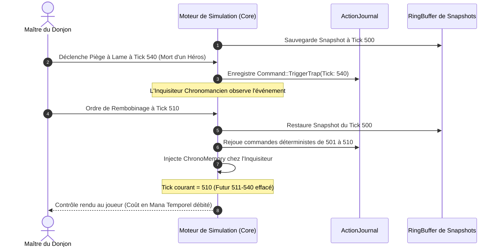

# Spécification Technique 05 — Chronomancie, Rembobinage & Paradoxes

| Métadonnée | Valeur |
| :--- | :--- |
| **Identifiant Domaine** | `SPEC-DOMAIN-CHRONO` |
| **Statut** | Validé / Source Unique de Vérité |
| **Auteur** | Ingénieur Système & Architecte Logiciel |
| **Version** | 1.0.0 |
| **Cible d'implémentation** | `crates/tomb_of_heroes_core` (Module `chrono`) |

---

## 1. Vue d'ensemble du Système

La Chronomancie est la mécanique maîtresse permettant au joueur de manipuler le flux temporel du donjon :
1. Toute action du joueur ou événement majeur est consigné sous forme de commande immuable dans un journal d'événements (`ActionJournal`).
2. Le moteur capture des instantanés complets réguliers (*Keyframe Snapshots*) pour permettre un **rembobinage temporel déterministe** par restauration d'instantané et rejeu sélectif.
3. Le rembobinage altère la causalité mais n'est pas sans contrepartie : certains aventuriers d'élite dotés de **Conscience Chronomantique** (`ChronoAwareness`) conservent le souvenir du futur effacé et s'adaptent pour déjouer les plans du joueur.



---

## 2. Exigences Spécifiées

### `SPEC-REQ-CHRONO-001` : Modèle Event Sourcing (`ActionJournal`)
* **Commande discrète :**
  Toute mutation provoquée par le joueur ou par une décision de script externe est formalisée par une structure sérialisable :
  ```rust
  #[derive(Debug, Clone, PartialEq, Eq)]
  pub struct TimedCommand {
      pub tick: Tick,
      pub command_id: LogicId,
      pub payload: CoreCommand,
  }

  #[derive(Debug, Clone, PartialEq, Eq)]
  pub enum CoreCommand {
      ArmTrap { coord: WorldCoord, trap_type: TrapType },
      TriggerTrapManual { trap_id: LogicId },
      TogglePortcullis { gate_id: LogicId, target_state: GateState },
      RaiseCorpse { corpse_id: LogicId, target_undead: UndeadKind },
      ChannelTemporalRewind { target_tick: Tick },
  }
  ```
* **Journal immuable :**
  `ActionJournal` enregistre les commandes dans l'ordre strict de leurs ticks. Les commandes simultanées au sein du même tick sont ordonnées de manière déterministe par leur `command_id` croissant.

### `SPEC-REQ-CHRONO-002` : Instantanés Périodiques & Algorithme de Rembobinage
* **Cadence des instantanés :**
  Un instantané compact `StateSnapshot` est généré tous les $K = 100 \text{ ticks}$ ($5,0 \text{ secondes}$ à $20 \text{ Hz}$).
* **Ring Buffer de conservation :**
  Le moteur conserve en mémoire vive les 12 derniers instantanés, offrant une fenêtre maximale de rembobinage de $1\,200 \text{ ticks}$ ($60 \text{ secondes}$).
* **Algorithme d'exécution du rembobinage vers $T_{\text{target}}$ :**
  1. Vérifier la validité de la cible :
     $$T_{\text{oldest\_snapshot}} \le T_{\text{target}} < T_{\text{current}}$$
  2. Trouver l'instantané $S_k$ tel que :
     $$k = \max(\{ t \in \text{Snapshots} \mid t \le T_{\text{target}} \})$$
  3. Remplacer l'état courant du `LogicWorld` par une copie conforme de $S_k$.
  4. Extraire de l'`ActionJournal` la sous-séquence des commandes comprises dans l'intervalle $[k + 1, \, T_{\text{target}}]$.
  5. Avancer la simulation tick-par-tick de $k$ jusqu'à $T_{\text{target}}$ en appliquant les commandes correspondantes.
  6. Élaguer (*truncate*) de l'`ActionJournal` toutes les commandes initialement enregistrées pour des ticks $> T_{\text{target}}$.
* **Coût en Entropie Temporelle :**
  Le rembobinage consomme du Mana Chronomantique selon la formule :
  $$\text{ChronoCost} = \text{BaseCost} + \left\lfloor \frac{(T_{\text{current}} - T_{\text{target}}) \times \text{TickCostBps}}{10\,000} \right\rfloor$$
  *Valeurs nominales :* $\text{BaseCost} = 20 \text{ Mana}$, $\text{TickCostBps} = 500 \text{ Mana/100 ticks}$.

### `SPEC-REQ-CHRONO-003` : Conscience Temporelle & Mémoire Résiduelle (`ChronoMemory`)
* **Héros Réceptifs :**
  Certains héros (Classes : *Chronomancien de Guerre*, *Inquisiteur Temporel*, ou héros ayant le trait *Éveillé aux Failles*) possèdent l'attribut `has_chrono_awareness: bool`.
* **Préservation mémorielle lors du rembobinage :**
  Lorsqu'un rembobinage de $T_{\text{current}}$ vers $T_{\text{target}}$ a lieu :
  * Pour les héros ordinaires : leur mémoire cognitive (`HeroKnowledgeMap` et perception) est réinitialisée à l'état exact du tick $T_{\text{target}}$.
  * Pour les héros dotés de `ChronoAwareness` :
    * Une structure `ChronoMemory` est conservée et fusionnée avec leur état restauré.
    * Tout piège déclenché ou tout allié tué entre $T_{\text{target}}$ et $T_{\text{current}}$ est marqué comme **Danger Anticipé** (`AnticipatedHazard`).
* **Réactions adaptatives des Héros Éveillés :**
  1. **Déviation de trajectoire :** L'aventurier évite activement la case du piège qu'il sait avoir été mortel dans la ligne temporelle effacée.
  2. **Bouclier préemptif :** Si l'aventurier ne peut contourner la tuile, il lève une barrière magique préventive 5 ticks avant le déclenchement supposé.
  3. **Terreur paradoxale :** Les alliés non éveillés qui l'entourent subissent une anxiété sourde ($+500 \text{ BPS de Terreur}$) en constatant que leur chef prédit les événements.

---

## 3. Matrice de Test-Driven Development (TDD)

### Cas de Test Nominaux à écrire en Rouge
1. `test_snapshot_creation_interval` : Vérifier qu'un instantané est automatiquement créé tous les 100 ticks et que le buffer contient exactement les instantanés attendus.
2. `test_deterministic_rewind_reaches_exact_state_hash` :
   - Simuler 250 ticks avec des commandes variées.
   - Enregistrer le `StateHash` au tick 150.
   - Poursuivre jusqu'au tick 250.
   - Rembobiner au tick 150 : vérifier que le `StateHash` restauré est bit-à-bit égal au `StateHash` original du tick 150.
3. `test_chrono_cost_calculation` : Calculer le coût de rembobinage pour 200 ticks et vérifier le débit exact sur la réserve de Mana Chronomantique.
4. `test_chrono_aware_hero_retains_hazard_memory` : Un piège déclenché au tick 180 tuant un allié est consigné dans le `ChronoMemory` d'un inquisiteur après rembobinage au tick 120.
5. `test_action_journal_truncates_discarded_future` : Après un rembobinage au tick 150, aucune commande de tick 160 ne doit subsister dans l'historique actif.

### Cas Limites & Invariants d'Erreur (Edge Cases)
1. `test_rewind_past_oldest_snapshot_fails_gracefully` : Tenter un rembobinage vers un tick antérieur au plus vieil instantané du RingBuffer retourne `Err(ChronoError::SnapshotExpired)`.
2. `test_rewind_to_current_tick_noop` : Demander un rembobinage vers le tick courant ne consomme aucune ressource et préserve l'état sans mutation.
3. `test_mana_exhaustion_prevents_rewind` : Tenter un rembobinage sans le solde de Mana requis retourne `Err(ChronoError::InsufficientMana)` et maintient la simulation au tick courant.
