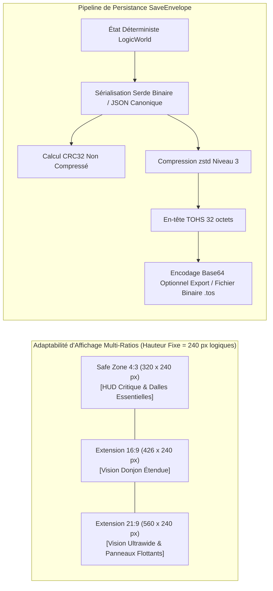

# Spécification Technique 06 — Sauvegardes & Cadrage Multi-Ratios

| Métadonnée | Valeur |
| :--- | :--- |
| **Identifiant Domaine** | `SPEC-DOMAIN-SAVE-VIEW` |
| **Statut** | Validé / Source Unique de Vérité |
| **Auteur** | Ingénieur Système & Architecte Logiciel |
| **Version** | 1.0.0 |
| **Cible d'implémentation** | `crates/tomb_of_heroes_core` (Module `save`) & `crates/tomb_of_heroes_app` (Module `viewport`) |

---

## 1. Vue d'ensemble

Le projet cible les terminaux mobiles (Android, iOS) ainsi que les plateformes desktop dans une configuration strictement solo et hors-ligne :
1. **Persistance & Échange :** Le format de sauvegarde doit être ultra-compact, intègre (CRC32), résistant à la corruption et exportable en texte clair (Base64) pour les transferts inter-appareils.
2. **Cadrage 2D Pixel-Art :** Le rendu doit garantir un affichage pixel-perfect sans scintillement ni déformation sur des ratios allant du $4:3$ (tablettes type iPad) au $21:9$ (smartphones ultra-larges), tout en sanctuarisant une **Zone de Sécurité (Safe Zone)** centrale de $320 \times 240$ pixels logiques.



---

## 2. Exigences Spécifiées

### `SPEC-REQ-SAVE-001` : Structure Binaire de l'Enveloppe (`SaveEnvelope`)
* **En-tête de 32 octets à disposition mémoire explicite :**
  ```rust
  #[repr(C)]
  #[derive(Debug, Clone, Copy, PartialEq, Eq)]
  pub struct SaveHeader {
      pub magic: [u8; 4],             // Constante formelle : [b'T', b'O', b'H', b'S'] ("Tomb Of Heroes Save")
      pub format_version: u16,        // Version du format (v1 = 0x0001)
      pub flags: u16,                 // Drapeaux (Bit 0: Zstd, Bit 1: Chiffré, Bit 2: Base64)
      pub campaign_id: [u8; 16],      // UUID v4 de la campagne en cours
      pub save_tick: u64,             // Horodatage logique Tick(u64)
      pub uncompressed_size: u32,     // Taille en octets avant compression
      pub compressed_size: u32,       // Taille en octets du payload compressé
      pub payload_crc32: u32,         // Checksum CRC32 (IEEE 802.3) du payload non compressé
      pub state_hash: u64,            // Empreinte logique StateHash pour validation post-chargement
  }
  ```
* **Payload compressé :**
  * Données sérialisées par `serde` compressées avec l'algorithme `zstd` (niveau 3 pour la rapidité sur mobile, niveau 9 pour l'exportation).
* **Validation d'intégrité à l'ouverture :**
  1. Vérifier `magic == b"TOHS"`.
  2. Décompresser le payload zstd.
  3. Vérifier que la taille décompressée est exactement égale à `uncompressed_size`.
  4. Calculer le CRC32 du flux décompressé et vérifier l'égalité avec `payload_crc32`.
  5. Désérialiser l'état et vérifier que le `StateHash` recalculé correspond à `state_hash`. Toute discordance déclenche `Err(SaveError::IntegrityViolation)`.

### `SPEC-REQ-SAVE-002` : Encodage d'Exportation Base64
* Pour permettre aux utilisateurs de sauvegarder sur le presse-papier ou d'exporter manuellement leur progression hors des dossiers protégés d'Android/iOS :
  * L'enveloppe binaire complète (Header + Payload) peut être convertie en chaîne ASCII Base64URL sécurisée encadrée par des balises :
    ```text
    -----BEGIN TOMB OF HEROES SAVE-----
    VE9IUwEAAAB...[Payload Base64]...==
    -----END TOMB OF HEROES SAVE-----
    ```

### `SPEC-REQ-VIEW-001` : Zone de Sécurité 2D & Ratios d'Aspect
* **Résolution logique de référence :**
  * Hauteur virtuelle fixe : $H_{\text{logic}} = 240 \text{ pixels}$.
  * Largeur virtuelle minimale : $W_{\text{min}} = 320 \text{ pixels}$ (Ratio $4:3$).
  * Largeur virtuelle nominale : $W_{\text{ref}} = 426 \text{ pixels}$ (Ratio $16:9$).
  * Largeur virtuelle maximale : $W_{\text{max}} = 560 \text{ pixels}$ (Ratio $21:9$).
* **Règle absolue de la Safe Zone ($320 \times 240$) :**
  * L'intégralité des boutons d'action vitaux, de la réserve de mana, des alertes de déroute et des jauges de vie doit être contenue dans le rectangle central de $320 \times 240$ pixels.
  * Les bandes latérales excédentaires (sur $16:9$ ou $21:9$) ne doivent afficher que de la surface de donjon additionnelle ou des volets de statistiques escamotables.

```text
+----------------------- Largeur Totale 21:9 (560 px) -----------------------+
| Extension Gauche |            SAFE ZONE 4:3            | Extension Droite |
|     (120 px)     |            (320 x 240 px)           |     (120 px)     |
|                  |  +-------------------------------+  |                  |
| [Panneau Stats]  |  |  Ressources / Alertes / HUD   |  | [Mini-Carte Max] |
|                  |  |  Zone d'Interaction Tactique  |  |                  |
|                  |  +-------------------------------+  |                  |
+----------------------------------------------------------------------------+
```

### `SPEC-REQ-VIEW-002` : Mise à l'Échelle Pixel-Perfect (Integer Scaling)
* Pour éviter le scintillement des dalles pixel-art (*pixel shimmering*) sur écran mobile haute résolution :
  * Le facteur de grandissement $S \in \mathbb{N}^*$ est déterminé par le plus grand entier vérifiant :
    $$S = \max\left(1, \, \min\left(\left\lfloor \frac{W_{\text{physique}}}{W_{\text{logic\_target}}} \right\rfloor, \, \left\lfloor \frac{H_{\text{physique}}}{240} \right\rfloor\right)\right)$$
  * La zone restante de l'écran physique est comblée par des barres neutres (*letterboxing / pillarboxing*) ou par l'expansion contrôlée du champ horizontal du donjon jusqu'à la limite $21:9$.
* **Prise en compte des encoches mobiles (*Safe Area Insets*) :**
  * Les marges matérielles de l'écran (encoches caméra, barre d'accueil iOS) sont traduites en padding logique pour garantir qu'aucun élément interactif n'est masqué.

---

## 3. Matrice de Test-Driven Development (TDD)

### Cas de Test Nominaux à écrire en Rouge
1. `test_save_envelope_roundtrip_zstd` :
   - Sérialiser un état de test contenant donjon, cadavres et historique.
   - Compresser et empaqueter en `SaveEnvelope`.
   - Désérialiser et vérifier l'intégrité bit-à-bit de l'état restauré.
2. `test_crc32_corruption_detection` :
   - Altérer 1 seul octet dans le payload compressé.
   - Tenter l'ouverture : vérifier le retour d'erreur strict `Err(SaveError::CrcMismatch)`.
3. `test_base64_export_string_formatting` : Vérifier qu'une enveloppe sérialisée produit un bloc texte délimité valide et décodable sans perte.
4. `test_viewport_integer_scale_calculation` :
   - Écran physique $1920 \times 1080$ $\to$ Facteur d'échelle $S = 4$ ($240 \times 4 = 960 \le 1080$).
   - Écran physique $2560 \times 1440$ $\to$ Facteur d'échelle $S = 6$.
5. `test_safe_zone_clamping` : Vérifier que les coordonnées des ancres UI restent confinées dans l'intervalle $[x_{\text{min}}, x_{\text{max}}] \subset [0, 320]$ quelle que soit la largeur d'écran.

### Cas Limites & Invariants d'Erreur (Edge Cases)
1. `test_save_magic_header_invalid` : Un fichier corrompu commençant par `[b'B', b'A', b'D', b'!']` doit être rejeté immédiatement sans allocation mémoire inutile.
2. `test_aspect_ratio_narrower_than_4_3` : Sur un ratio atypique plus étroit que $4:3$ (ex: $1:1$ ou écran carré), l'échelle doit privilégier la largeur pour que la Safe Zone reste entièrement visible avec letterboxing vertical.
3. `test_empty_save_payload` : Un payload de 0 octet doit déclencher une erreur formelle sans provoquer de panique.
