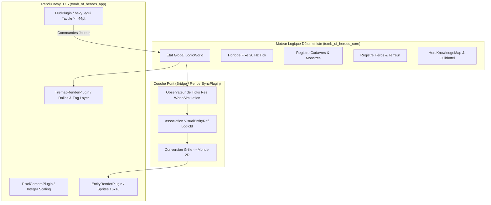

# Spécification Technique 07 — Frontend, Rendu Pixel-Art & Interface Tactile

| Métadonnée | Valeur |
| :--- | :--- |
| **Identifiant Domaine** | `SPEC-DOMAIN-FRONTEND` |
| **Statut** | Validé / Source Unique de Vérité |
| **Auteur** | Ingénieur Système & Architecte Rendu |
| **Version** | 1.0.0 |
| **Cible d'implémentation** | `crates/tomb_of_heroes_app` (Modules `camera`, `render`, `ui`, `asset_gen`) |
| **Référence Dépendances** | Bevy 0.15, `bevy_egui` 0.31 |

---

## 1. Vue d'ensemble architecturale

Le conteneur applicatif `tomb_of_heroes_app` fournit la couche de présentation audiovisuelle et tactile de *Tomb of Heroes*. Il assure le pontage strict entre la simulation déterministe 20 Hz (`tomb_of_heroes_core`) et le pipeline de rendu Bevy 0.15.



---

## 2. Exigences Spécifiées

### `SPEC-REQ-FRONT-001` : Projection, Viewport et Caméra 2D Pixel-Perfect

#### 1. Résolution Logique & Zone de Sécurité (Safe Zone)
* **Résolution de référence nominale (16:9) :** $W_{\text{ref}} = 640 \text{ px}$, $H_{\text{ref}} = 360 \text{ px}$.
* **Zone de Sécurité garantie (Safe Zone 4:3) :** $W_{\text{min}} = 320 \text{ px}$, $H_{\text{min}} = 240 \text{ px}$.
  * Tout élément critique de gameplay (salles centrales, alertes, boutons vitaux) doit être strictement visible dans ce rectangle central.
* **Largeur maximale sans letterboxing (21:9 ultrawide) :** $W_{\text{max}} = 560 \text{ px}$.

#### 2. Échelle Entière Dynamique (*Integer Scaling*)
Pour proscrire tout flou de sous-pixel (*subpixel shimmering*), le facteur de mise à l'échelle de la caméra $S \in \mathbb{N}^*$ est déterminé dynamiquement par :

$$\text{Scale} = \max\left(1, \min\left(\left\lfloor \frac{W_{\text{fenêtre}}}{320} \right\rfloor, \left\lfloor \frac{H_{\text{fenêtre}}}{240} \right\rfloor\right)\right)$$

* La caméra orthographique Bevy `Camera2d` est configurée avec un facteur d'échelle inverse pour la projection :
  $$\text{OrthographicProjection.scale} = \frac{1.0}{\text{Scale}}$$
  ou via un viewport rectangulaire centré (`bevy::render::camera::Viewport`) appliquant les dimensions rendues physiques $W_{\text{rendu}} = W_{\text{virtuel}} \times S$ et $H_{\text{rendu}} = H_{\text{virtuel}} \times S$.

#### 3. Échantillonnage Texture Nearest-Neighbor
* L'échantillonneur de textures par défaut de Bevy doit impérativement être paramétré sur `ImageSampler::nearest()` afin d'interdire tout filtrage bilinéaire flou.

#### 4. Cadrage et Letterboxing / Pillarboxing
* Si le ratio d'écran physique est plus étroit que $4:3$, des bandes noires horizontales (*letterboxing*) encadrent la vue.
* Si le ratio d'écran physique est plus large que $21:9$, des bandes noires verticales (*pillarboxing*) limitent l'extension du champ visuel à $560 \text{ px}$ logiques de largeur.
* Entre $4:3$ et $21:9$, la caméra dévoile une largeur de donjon continue sans bandes noires.

---

### `SPEC-REQ-FRONT-002` : Pipeline d'Assets Pixel-Art Procéduraux 16×16

#### 1. Autonomie Zéro-Dépendance
* Pour garantir l'exécution immédiate sur toute machine ou simulateur mobile sans nécessiter de téléchargements manuels, un générateur procédural produit un fichier d'atlas au format PNG : `assets/textures/dungeon_sheet.png`.
* Dimensions de chaque cellule de tuile : $16 \times 16$ pixels.
* Format d'exportation : PNG 32-bit RGBA sans perte.

#### 2. Palette Rétro DB16 Formelle
L'ensemble des visuels utilise strictement les 16 teintes suivantes :

| Index | Nom | Valeur Hexadécimale | Usage Graphique |
| :--- | :--- | :--- | :--- |
| `0x0` | Noir Néant | `#141013` | Fond, ombres profondes, brouillard inexploré |
| `0x1` | Violet Sombre | `#3b1725` | Miasme de terreur, ornementation nécromantique |
| `0x2` | Bleu Nuit | `#1a1c2c` | Armures de gardes, murs de roche sombre |
| `0x3` | Gris Ardoise | `#3b3a4a` | Dalles de pierre taillée, herses en fer |
| `0x4` | Gris Pierre | `#566c86` | Sol standard de salle, escaliers de pierre |
| `0x5` | Bleu Céleste | `#33984b` | Fosse d'acide verdâtre, poisons |
| `0x6` | Vert Mousse | `#5ac54f` | Teinte acide claire, runes actives |
| `0x7` | Brun Cuir | `#733e39` | Portes en bois, manches d'armes, terre battue |
| `0x8` | Ocre / Sable | `#cf651f` | Torches, alertes modérées, rouille |
| `0x9` | Or Ancien | `#f4b41b` | Pièces d'or, insignes de guilde, paladin |
| `0xA` | Blanc Os | `#f0d6b6` | Squelettes, cadavres d'aventuriers, runes |
| `0xB` | Gris Métal | `#94b0c2` | Épées guerrier, armures de plates |
| `0xC` | Bleu Magie | `#566c86` | Robes de mage, orbes mana |
| `0xD` | Rouge Sang | `#8a1923` | Dépouilles, blessures, danger critique |
| `0xE` | Pourpre Royal | `#a53030` | Cape du Boss/ArchLich, bannières |
| `0xF` | Blanc Pur | `#ffffff` | Éclats spéculaires, yeux rougeoyants/blancs |

#### 3. Catalogue des Sprites & Indexation dans l'Atlas
La feuille de sprites est agencée sous forme d'une grille de $8 \times 4 = 32$ cellules de $16 \times 16$ pixels :

```text
+----+----+----+----+----+----+----+----+
| 00 | 01 | 02 | 03 | 04 | 05 | 06 | 07 |  Ligne 0 : Décors & Dalles
+----+----+----+----+----+----+----+----+
| 08 | 09 | 10 | 11 | 12 | 13 | 14 | 15 |  Ligne 1 : Héros Aventuriers
+----+----+----+----+----+----+----+----+
| 16 | 17 | 18 | 19 | 20 | 21 | 22 | 23 |  Ligne 2 : Monstres, Boss & Invocations
+----+----+----+----+----+----+----+----+
| 24 | 25 | 26 | 27 | 28 | 29 | 30 | 31 |  Ligne 3 : Dépouilles, Fog & Overlays
+----+----+----+----+----+----+----+----+
```

* **Index 00 :** Sol en dalles de pierre standard (`FloorTile`).
* **Index 01 :** Mur de roche infranchissable opaque (`WallTile`).
* **Index 02 :** Escalier descendant vers étage inférieur (`StairsDown`).
* **Index 03 :** Escalier montant vers étage supérieur (`StairsUp`).
* **Index 04 :** Fosse d'acide / crématorium piégé (`AcidPit`).
* **Index 05 :** Porte en bois / herse fermée (`PortcullisClosed`).
* **Index 06 :** Porte ouverte (`PortcullisOpen`).
* **Index 07 :** Dalle sanctifiée par rites divins (`SanctifiedFloor`).
* **Index 08 :** Héros Guerrier (`HeroWarrior`).
* **Index 09 :** Héros Clerc / Soigneur (`HeroCleric`).
* **Index 10 :** Héros Paladin (`HeroPaladin`).
* **Index 11 :** Héros Mage (`HeroMage`).
* **Index 12 :** Héros Voleur (`HeroRogue`).
* **Index 13 :** Héros Nécromancien rival (`HeroNecromancer`).
* **Index 14 :** Aventurier en panique aveugle (`HeroPanicked`).
* **Index 15 :** Aventurier en fuite vers la sortie (`HeroRetreating`).
* **Index 16 :** Gardien Squelette réanimé (`MonsterSkeleton`).
* **Index 17 :** Zombie putréfié robuste (`MonsterZombie`).
* **Index 18 :** Spectre d'ombre (`MonsterSpectre`).
* **Index 19 :** Boss du Donjon / Maître des lieux (`BossOverlord`).
* **Index 20 :** Piège à piques armé (`TrapSpikes`).
* **Index 21 :** Piège déclenché / inactif (`TrapSprung`).
* **Index 22 :** Orbe d'âme / essence harvestable (`SoulEssence`).
* **Index 23 :** Effet d'explosion macabre (`ExplosionFx`).
* **Index 24 :** Cadavre intact (`CorpseIntact`).
* **Index 25 :** Cadavre endommagé / lacéré (`CorpseDamaged`).
* **Index 26 :** Ossements détruits / restes pulvérisés (`CorpseBones`).
* **Index 27 :** Brouillard inexploré opaque (`FogUnexplored`).
* **Index 28 :** Masque de brouillard exploré semi-transparent (`FogExplored`).
* **Index 29 :** Overlay surbrillance tuile compromise guilde ($K \ge 128$) (`IntelCompromised`).
* **Index 30 :** Miasme de terreur vaporeux (`TerrorMiasma`).
* **Index 31 :** Curseur de sélection tactique actif (`TileCursor`).

---

### `SPEC-REQ-FRONT-003` : Synchronisation Déterministe Core -> Visuals (`RenderSyncPlugin`)

#### 1. Invariant d'Isolation et Bridge Pattern
* Le crate `tomb_of_heroes_core` demeure 100 % vierge de tout import Bevy ou type flottant.
* Toute entité visuelle dans `tomb_of_heroes_app` porte un composant de liaison :
  ```rust
  #[derive(Component, Debug, Clone, Copy, PartialEq, Eq, Hash)]
  pub struct VisualEntityRef(pub LogicId);
  ```

#### 2. Conversion Cartésienne vers Coordonnées Monde Bevy
* La grille du Core utilise des coordonnées entières $x, y \in \mathbb{Z}$ avec $y$ croissant vers le bas ou le haut.
* Dans l'espace monde 2D de Bevy :
  $$X_{\text{monde}} = x \times 16.0, \quad Y_{\text{monde}} = -y \times 16.0$$
  * Justification : L'axe $Y$ de la caméra 2D Bevy pointe vers le haut, alors que l'indexation de grille standard commence en haut à gauche ($y = 0$). L'inversion de signe maintient le Nord logique en haut de l'écran.

#### 3. Ordonnancement des Couches Z (*Depth Stacking*)
Pour éliminer tout conflit d'occlusion ou de clignotement (*Z-fighting*) :

| Couche | Élévation $Z$ | Contenu |
| :--- | :--- | :--- |
| `Z_FLOOR` | `0.0` | Dalles de sol ordinaires, dalles sanctifiées |
| `Z_GROUND_DECORS` | `1.0` | Escaliers, fosses d'acide, trappes |
| `Z_CORPSES` | `2.0` | Dépouilles (`CorpseState::Intact`, `Damaged`, `Destroyed`) |
| `Z_CREATURES` | `3.0` | Héros vivants, gardes squelettes, zombies, boss |
| `Z_WALLS` | `4.0` | Murs verticaux et piliers occultants |
| `Z_FOG_OF_WAR` | `5.0` | Tuiles d'inconnu, brume explorée |
| `Z_OVERLAYS` | `6.0` | Teinte d'intel guilde compromise, miasme de terreur |
| `Z_CURSOR` | `7.0` | Curseur de sélection de case, réticule |

#### 4. Cycle de Synchronisation à 20 Hz
* Le système `sync_entities_from_core_system` s'exécute à chaque tick de la ressource `WorldSimulation` :
  1. **Scrutation des vivants :** Pour chaque `ChronoHero` dans `world.heroes()`, vérifier si une entité Bevy portant `VisualEntityRef(hero.hero_id)` existe. Si absente, spawner le sprite avec l'indice d'atlas correspondant à sa classe (`HeroWarrior`, `HeroMage`, etc.). Si présente, synchroniser `Transform.translation` vers $(x \times 16, -y \times 16, Z_{\text{CREATURES}})$. Si en panique aveugle, commuter le sprite vers `HeroPanicked`.
  2. **Scrutation des dépouilles :** Pour chaque `Corpse` dans `world.corpses()`, vérifier si une entité Bevy portant `VisualEntityRef(corpse.corpse_id)` existe. Si absente, spawner avec `CorpseIntact`. Si présente, actualiser le sprite selon `corpse.state` (`Intact` -> `Index 24`, `Damaged` -> `Index 25`, `Destroyed` -> `Index 26`).
  3. **Despawn des disparus :** Toute entité visuelle dont le `LogicId` n'existe plus dans le Core (par exemple, cadavre entièrement pulvérisé ou héros ayant fui la carte) est révoquée via `commands.entity(e).despawn_recursive()`.

---

### `SPEC-REQ-FRONT-004` : Rendu du Brouillard de Guerre & Visualisation du Renseignement

#### 1. Masquage Visuel par Couche Supérieure
* Chaque case visible du donjon dispose d'une entité de brouillard dédiée à $Z = 5.0$.
* L'état visuel est asservi au mode d'affichage sélectionné par le joueur :
  * **Mode Omniscient (Vision Donjon) :** Le maître du donjon voit toutes ses salles, mais les dalles hors du champ de vision actuel de ses gardes ont une teinte assombrie de $30\%$.
  * **Mode Simulation Héros (Vision de l'Escouade) :** Application stricte de la `HeroKnowledgeMap` :
    - `TileVisibility::Unexplored` $\to$ Sprite `FogUnexplored` (opaque, masque noir `#141013`).
    - `TileVisibility::Explored` $\to$ Sprite `FogExplored` (ombrage à $50\%$ d'opacité).
    - `TileVisibility::InSight` $\to$ Sprite invisible / transparent.

#### 2. Visualisation de la Fuite de Renseignement (`GuildIntelRegister`)
* Lorsqu'une dalle du donjon a été compromise par un héros fugitif (indice de confiance $K \ge 128$), une entité overlay à $Z = 6.0$ affiche le sprite `IntelCompromised` :
  - Teinte rougeoyante carmin pulsée ou fixe pour avertir le joueur que la guilde connaît l'emplacement de ses pièges ou salles.
* Le miasme de terreur (`terror_miasma > 0`) génère une nappe violacée semi-transparente `TerrorMiasma` à $Z = 6.0$.

---

### `SPEC-REQ-FRONT-005` : HUD & Interface Tactile via `bevy_egui`

#### 1. Règle d'Ergonomie Tactile Mobile
* **Taille minimale des cibles d'interaction :** Tout bouton, curseur ou onglet doit occuper une zone tactile effective d'au minimum $44 \times 44$ points/pixels d'interface, conformément aux directives Apple Human Interface Guidelines et Android Touch Target Standards.
* **Marges de confort (Safe Insets) :** Marge de $12 \text{ px}$ par rapport aux bords physiques de l'écran pour éviter toute collision avec la barre de statut système ou l'indicateur d'accueil iOS.

#### 2. Architecture des Composants HUD

```text
+----------------------------------------------------------------------------+
| [Status Bar] Mana: 85/100 | Infamie: 120 | Alerte: ELEVEE | Etage: N0 | T: 420 |
+----------------------------------------------------------------------------+
|                                                                            |
|                             VUE DU DONJON 2D                               |
|                     (Dalles, Monstres, Cadavres, Fog)                      |
|                                                                            |
+----------------------------------------------------------------------------+
| [Chronomancie] Rewind: [ < T-20 > ] | Cout: 15 Mana | Risque: 120 BPS | [OK]|
+----------------------------------------------------------------------------+
| [Action Bar] [Mur] [Squelette] [Zombie] [Piege Acide] | [Lancer Incursion] |
+----------------------------------------------------------------------------+
```

1. **Bandeau Supérieur (`StatusBar`) :**
   * Réserve de mana / essence d'âmes.
   * Compteur d'infamie accumulée.
   * Jauge d'alerte de la Guilde (Normal, Suspicieux, Élevé, Critique).
   * Sélecteur d'étage actif ($N_0, N_1, \dots$).
   * Horodatage `Tick(u64)` et numéro de vague en cours.
2. **Module de Chronomancie (`ChronoPanel`) :**
   * Bouton d'accès au rembobinage temporel.
   * Curseur glissant (*slider*) tactile pour remonter jusqu'à $N$ snapshots en arrière.
   * Affichage instantané du coût prévisionnel en mana et du risque d'anxiété paradoxale infligée aux aventuriers conscients.
   * Bouton de confirmation d'annulation temporelle (`SPEC-REQ-CHRONO-001`).
3. **Barre d'Actions Inférieure (`ActionBar`) :**
   * Grille de sélection d'outils tactiles ($48 \times 48 \text{ pt}$) :
     - Pose de mur / barricade.
     - Invocation de sentinelle squelette (coût mana).
     - Relèvement de zombie sur cadavre intact.
     - Armement de piège à piques ou fosse d'acide.
   * Bouton d'incursion : déclenche l'entrée de la prochaine vague d'aventuriers.
4. **Gestionnaire de Sauvegardes (`SaveModal`) :**
   * Fenêtre modale pour persistance : Nouveau profil, Cloner profil actif, Exporter en chaîne Base64 dans le presse-papier, Importer code de sauvegarde, Recharger dernier point de contrôle.

---

### `SPEC-REQ-FRONT-006` : Navigation et Gestes Tactiles Mobiles

#### 1. Gestes Supportés

| Geste Tactile | Équivalent Souris / Clavier | Action Résultante |
| :--- | :--- | :--- |
| **Glissement 1 doigt (*Pan*)** | Clic gauche enfoncé + Déplacer / Flèches / ZQSD | Déplacement fluide de la caméra sur le plan du donjon |
| **Pincement 2 doigts (*Pinch*)** | Molette de la souris (*Scroll*) | Modification du niveau de zoom par paliers entiers discrets ($1\times, 2\times, 3\times, 4\times$) |
| **Toucher simple (*Tap*)** | Clic gauche court | Sélection de la dalle ou entité sous le pointeur pour afficher l'inspecteur |

#### 2. Inspecteur d'Entité et de Dalle
Lors d'un tapotement sur une entité ou case :
* Affichage d'un panneau d'information contextuel rétractable :
  * Type de dalle, praticabilité, opacité.
  * Si cadavre : Nom de classe du héros défunt, intégrité physique (`Intact`, `Damaged`, `Destroyed`), points de vie résiduels, valeur d'essence d'âme.
  * Si aventurier vivant : Points de vie, classe, jauge de terreur ($0 \dots 10\,000$ BPS), statut de conscience temporelle.
  * Si piège : Type d'armement, état d'amorçage.

---

## 3. Matrice de Test-Driven Development (TDD)

### Cas de Test Nominaux à Écrire en Rouge

1. `test_integer_scale_formula_various_resolutions` :
   - Écran $320 \times 240 \implies \text{Scale} = 1$.
   - Écran $640 \times 480 \implies \text{Scale} = 2$.
   - Écran $1280 \times 720 \implies \text{Scale} = 3$ ($\min(1280/320, 720/240) = \min(4, 3) = 3$).
   - Écran $1920 \times 1080 \implies \text{Scale} = 4$ ($\min(6, 4) = 4$).
   - Écran $2560 \times 1440 \implies \text{Scale} = 6$.
2. `test_grid_to_world_coordinate_conversion` :
   - Grid $(0, 0) \implies (0.0, 0.0)$.
   - Grid $(5, 3) \implies (80.0, -48.0)$.
   - Grid $(-2, 4) \implies (-32.0, -64.0)$.
3. `test_asset_generator_png_dimensions_and_validity` :
   - Synthétiser l'atlas en mémoire ou sur disque.
   - Vérifier que l'image fait exactement $128 \times 64$ pixels (8 colonnes $\times$ 4 lignes de $16 \times 16$).
   - Vérifier le header magique PNG `[0x89, 0x50, 0x4E, 0x47]`.
4. `test_render_sync_spawns_and_despawns_visual_entities` :
   - Initialiser un `WorldSimulation` avec 1 héros et 1 cadavre.
   - Exécuter le système de synchronisation.
   - Vérifier la présence de 2 entités Bevy avec les `VisualEntityRef` correspondants.
   - Supprimer le cadavre du Core et relancer le système : vérifier le despawn effectif de l'entité visuelle.
5. `test_hud_touch_target_minimum_size` :
   - Vérifier que chaque bouton d'action principal et de contrôle temporel possède des dimensions $\ge 44.0 \text{ pt}$.

### Cas Limites & Invariants d'Erreur (Edge Cases)

1. `test_zero_or_negative_window_size_scaling` :
   - Une fenêtre redimensionnée à $(0, 0)$ ou $(100, 50)$ doit renvoyer $\text{Scale} = 1$ sans division par zéro.
2. `test_corpse_state_visual_transition` :
   - Transition d'un cadavre de `Intact` vers `Damaged` puis `Destroyed` : le composant de sprite visuel doit basculer vers les index respectifs 24, 25 et 26.
3. `test_pan_pinch_zoom_clamping` :
   - Le zoom par pincement ne doit jamais descendre en dessous de $1\times$ ni excéder $8\times$.
