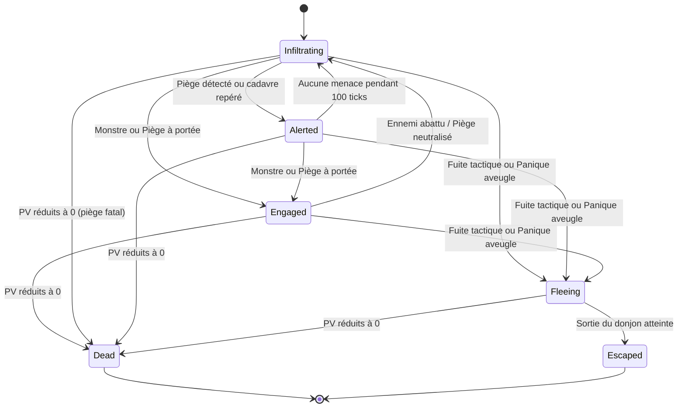

# Spécification Technique 08 — Boucle de Simulation & IA Active des Héros

| Métadonnée | Valeur |
| :--- | :--- |
| **Identifiant Domaine** | `SPEC-DOMAIN-SIM` |
| **Statut** | Validé / Source Unique de Vérité |
| **Auteur** | Ingénieur Système & Lead AI Designer |
| **Version** | 1.0.0 |
| **Cible d'implémentation** | `crates/tomb_of_heroes_core` (`world.rs`, `topo/`, `necro/`) & `crates/tomb_of_heroes_app` |

---

## 1. Vue d'ensemble & Problématique

Le moteur déterministe de *Tomb of Heroes* possède actuellement des briques algorithmiques spécialisées (A*, FOV, calculs de terreur, pile de cadavres), mais la fonction maîtresse `LogicWorld::step()` n'exécute actuellement qu'une incrémentation de l'horloge logique (`current_tick.advance()`).

Cette spécification définit l'ordonnancement séquentiel strict de chaque pas de simulation (20 Hz / 50 ms) ainsi que la machine à états finis (FSM) comportementale régissant les héros explorateurs dans le donjon.

```mermaid
flowchart TD
    subgraph TickOrchestration ["Cycle d'Exécution d'un Tick (20 Hz)"]
        T0[Début du Tick n] --> T1[Phase 1 : Injection des Intentions & Commandes Joueur]
        T1 --> T2[Phase 2 : Horloge & Décroissance des Cooldowns]
        T2 --> T3[Phase 3 : Perception & Brouillard FOV des Héros]
        T3 --> T4[Phase 4 : Psychologie & Accumulation de Terreur]
        T4 --> T5[Phase 5 : Évaluation des Transitions d'États FSM]
        T5 --> T6[Phase 6 : Déplacement Déterministe sur Navmesh A*]
        T6 --> T7[Phase 7 : Interaction Environnement & Déclenchement Pièges]
        T7 --> T8[Phase 8 : Résolution des Combats & Trépas]
        T8 --> T9[Phase 9 : Snapshot Chronomantique Cadencé]
        T9 --> T10[Fin du Tick n / Calcul StateHash]
    end
```

---

## 2. Exigences Spécifiées

### `SPEC-REQ-SIM-001` : Ordonnancement Séquentiel du Tick Logique
* **Fréquence :** 20 Hz discrets (50 ms par pas).
* **Ordre d'exécution obligatoire :**
  1. **Consommation des commandes :** Dépilement et validation des `CoreCommand` émises par le joueur ou le système de rembobinage.
  2. **Gestion temporelle :** Avancement de `current_tick` et décrémentation des temporisateurs d'action/cooldowns.
  3. **Perception sensorielle :** Calcul du champ de vision pour chaque héros vivant via `compute_hero_fov` et mise à jour de la `HeroKnowledgeMap`.
  4. **Stress & Terreur :** Rayonnement macabre des cadavres environnants (`accumulate_terror`) et mise à jour du `TerrorPoints` de chaque héros.
  5. **Mise à jour FSM :** Évaluation des conditions de fuite, d'alerte ou de panique aveugle.
  6. **Locomotion :** Avancement sur le chemin A* calculé si le héros est prêt à se déplacer.
  7. **Interactions :** Détection de tuiles spéciales (pièges, dalles, portes, escaliers).
  8. **Combat :** Échanges de coups si des entités hostiles partagent ou jouxtent la même case.
  9. **Archivage :** Prise de snapshot par le `ChronoRingBuffer` si le modulo de capture est atteint (`tick % snapshot_cadence == 0`).
* **Invariant de déterminisme :** Le tri des entités actives pour chaque phase s'effectue systématiquement par ordre croissant de `LogicId`. Aucun itérateur non trié (`HashMap`) n'est toléré.

### `SPEC-REQ-SIM-002` : Machine à États Finis (FSM) du Héros
Chaque héros possède un état exclusif `HeroState` :

* **`Infiltrating` (Exploration nominale) :**
  * Le héros avance vers l'objectif de la mission (escalier descendant vers l'étage inférieur ou Cœur du Donjon).
  * Vitesse nominale de progression selon la classe :
    * Guerrier : 1 déplacement toutes les 10 frames (2 tuiles/seconde).
    * Roublard : 1 déplacement toutes les 6 frames (~3,33 tuiles/seconde).
    * Mage : 1 déplacement toutes les 12 frames (~1,67 tuiles/seconde).
    * Clerc : 1 déplacement toutes les 10 frames (2 tuiles/seconde).
* **`Alerted` (Vigilance accrue) :**
  * Déclenché si un cadavre ou un piège est en vue.
  * Réduit la vitesse de déplacement de 50% (recherche de pièges active, bonus de détection de +2000 BPS).
* **`Engaged` (Combat) :**
  * Le mouvement est interrompu. Le héros engage l'entité hostile adjacente (minion ou piège actif).
* **`Fleeing` (Repli d'urgence) :**
  * La cible A* devient la sortie la plus proche (point de spawn d'origine à l'étage 0).
  * Vitesse de fuite augmentée de +50% (course éperdue).
  * En état de **Panique Aveugle** (`PanicLevel::BlindPanic`), le héros ignore la détection des pièges et avance en ligne droite sans désamorcer.
* **`Dead` (Trépas) :**
  * L'entité cesse d'exister en tant qu'agent vivant et est convertie atomiquement en `Corpse`.
* **`Escaped` (Évacuation réussie) :**
  * Le héros sort du donjon et transmet son savoir accumulé à la Guilde.

### `SPEC-REQ-SIM-003` : Cadence de Replanification A* & Cache de Chemin
* **Problématique :** Calculer un chemin A* pour chaque héros à chaque tick de 50 ms est inutile et coûteux en CPU.
* **Règle de cache et de mise à jour :**
  * Un chemin calculé `Vec<WorldCoord>` est stocké dans la mémoire de l'agent.
  * Le chemin est recalculé **uniquement** si :
    1. Le héros n'a aucun chemin actif (`path.is_empty()`).
    2. La tuile cible ou une tuile du chemin prévu est devenue infranchissable (ex. pose d'un mur ou fermeture d'une herse par le joueur).
    3. L'état mental bascule en `Fleeing` (changement radical de destination vers la sortie).
    4. Un intervalle maximal de 60 ticks (3 secondes) s'est écoulé (re-vérification périodique d'opportunité).

### `SPEC-REQ-SIM-004` : Règle d'Occupation des Tuiles & Résolution des Conflits
* **Densité maximale de héros par case :** 1 héros par tuile en mouvement nominal.
* **Conflit de mouvement (2 héros voulant la même case au même tick) :**
  * Arbitrage déterministe : l'agent ayant le plus petit `LogicId` avance en priorité.
  * L'agent bloqué patiente sur sa case courante (`wait_ticks += 1`). Si `wait_ticks >= 6`, son chemin A* est recalculé pour contourner l'obstacle.

---

## 3. Matrice de Traçabilité & Tests TDD

| Réf Exigence | Type Test | Scénario de Validation | Résultat Attendu |
| :--- | :--- | :--- | :--- |
| `SPEC-REQ-SIM-001` | Intégration | Simulation séquentielle complète sur 100 ticks | Progression ordonnée, StateHash 100% reproductible |
| `SPEC-REQ-SIM-002` | Unitaire FSM | Héros face à un cadavre terrifiant | Transition de `Infiltrating` vers `Alerted` puis `Fleeing` |
| `SPEC-REQ-SIM-003` | Unitaire A* | Pose d'un mur sur la trajectoire d'un héros | Invalidation immédiate du cache et recalcul du contournement |
| `SPEC-REQ-SIM-004` | Unitaire Conflit | 2 héros se croisant dans un couloir étroit | Priorité au `LogicId` le plus faible, pas de blocage infini |
