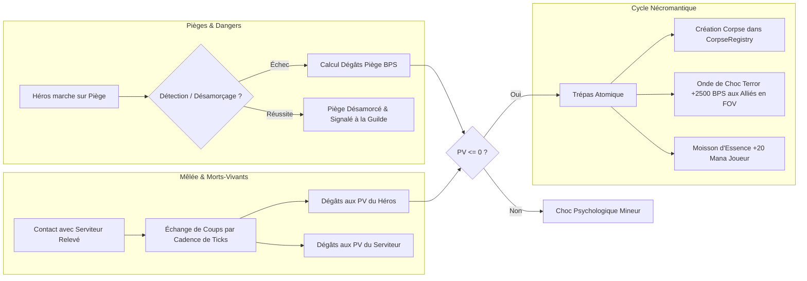

# Spécification Technique 09 — Combat, Résolution des Pièges & Dégâts Déterministes

| Métadonnée | Valeur |
| :--- | :--- |
| **Identifiant Domaine** | `SPEC-DOMAIN-COMBAT` |
| **Statut** | Validé / Source Unique de Vérité |
| **Auteur** | Lead Combat & Balance Designer |
| **Version** | 1.0.0 |
| **Cible d'implémentation** | `crates/tomb_of_heroes_core` (`world.rs`, `necro/`, `intel/`) |

---

## 1. Vue d'ensemble & Philosophie de Combat

Dans *Tomb of Heroes*, le joueur n'affronte pas directement les héros au corps-à-corps : il est le Maître du Donjon qui agence des pièges diaboliques et relève des légions de morts-vivants pour briser la détermination des intrus.

Le combat et la létalité doivent obéir aux principes suivants :
1. **Déterminisme absolu :** Aucun calcul flottant. Les jets d'esquive et de dégâts utilisent le flux PRNG dédié `PrngStream::Combat`.
2. **Génération atomique de la mort :** Le trépas d'un héros doit immédiatement alimenter la boucle de gameplay nécromantique en créant un cadavre manipulable et en irradiant de la terreur sur ses compagnons survivants.
3. **Synergie macabre :** Les pièges blessent, les cadavres terrifient, et les serviteurs bloquent les couloirs pour maximiser l'efficacité des pièges.

---

## 2. Exigences Spécifiées

### `SPEC-REQ-COMBAT-001` : Typologie & Résolution des Pièges
Chaque piège possède des caractéristiques entières fixes :

| Type de Piège | Coût Mana | Dégâts Bruts | Fréquence Déclenchement | Effet Spécial |
| :--- | :--- | :--- | :--- | :--- |
| **Piques au sol (`Spikes`)** | 15 Mana | 35 PV | Au passage d'une entité | Dégâts doublés si l'entité est en `Fleeing` |
| **Puits d'Acide (`Acid`)** | 25 Mana | 15 PV/sec (sur 3 sec) | Contact continu | Réduit l'armure de 2000 BPS de façon permanente |
| **Herse Écrasante (`Portcullis`)** | 20 Mana | 80 PV | Déclenchement manuel/levier | Bloque le passage et immobilise |
| **Fléchettes Murale (`Darts`)** | 10 Mana | 20 PV | Ligne de mire (distance 4) | Empoisonne (perte de 5 PV/sec) |

* **Détection des pièges par les héros :**
  * La probabilité de repérer un piège dépend de la classe et de l'état :
    * Roublard : 8000 BPS (80%).
    * Autres classes : 2000 BPS (20%).
    * Bonus état `Alerted` : +2000 BPS.
    * Malus état `PanicLevel::BlindPanic` : 0 BPS (détection totalement désactivée, les fuyards foncent tête baissée).
  * Si le piège est détecté par un Roublard : tentative de désamorçage (succès 7500 BPS). Si réussi, le piège est désarmé et inscrit dans l'intel de guilde.

### `SPEC-REQ-COMBAT-002` : Formule Générale de Dégâts Entière
Pour tout événement infligeant des dégâts bruts $D_{\text{base}}$ contre une entité possédant une armure conférant une réduction $R_{\text{armor}}$ en BPS (bornée entre $0$ et $8\,000$ BPS) :

$$D_{\text{effectif}} = \max\left(1, \left\lfloor \frac{D_{\text{base}} \times (10\,000 - R_{\text{armor}}) + 5\,000}{10\,000} \right\rfloor\right)$$

* En cas de coup critique (tirage PRNG `Combat` $\le \text{CritChanceBps}$) :
  $$D_{\text{crit}} = \left\lfloor \frac{D_{\text{effectif}} \times 15\,000 + 5\,000}{10\,000} \right\rfloor \quad (+50\,\%)$$

### `SPEC-REQ-COMBAT-003` : Serviteurs Nécromantiques & Statistiques
Les serviteurs relevés par le joueur agissent comme gardiens statiques ou patrouilleurs :

| Serviteur | Coût Invocation | PV Max | Attaque | Cadence d'Attaque | Propriété Spéciale |
| :--- | :--- | :--- | :--- | :--- | :--- |
| **Squelette (`Skeleton`)** | 20 Mana | 30 PV | 15 Dégâts | 1 coup tous les 20 ticks (1 sec) | Attaque rapide, inflige 500 BPS de terreur |
| **Zombie (`Zombie`)** | 30 Mana | 90 PV | 25 Dégâts | 1 coup tous les 40 ticks (2 sec) | Résistance 3000 BPS, inflige 1500 BPS de terreur |
| **Spectre (`Spectre`)** | 45 Mana | 40 PV | 20 Dégâts | 1 coup tous les 20 ticks (1 sec) | Traverse les murs (`TileOpacity::Opaque`), ignore l'armure |

### `SPEC-REQ-COMBAT-004` : Séquence Atomique du Trépas (*Death Sequence*)
Lorsque les PV d'un héros tombent à $0$ au cours du pas de simulation :
1. **Événement `HeroDied` émis :** capture du `LogicId`, de la classe, du niveau de vétérance et de la coordonnée spatiale `WorldCoord`.
2. **Suppression de la liste des vivants :** Retrait immédiat de `LogicWorld::heroes`.
3. **Apparition du Cadavre :**
   * Instanciation d'un nouveau `Corpse` avec `CorpseState::Intact`.
   * Enregistrement dans `CorpseRegistry::place_corpse`. Si la case possède déjà 3 cadavres, l'algorithme de glissement (*slide-at-capacity-3*) pousse le nouveau corps sur une case libre adjacente.
4. **Onde de Choc Psychologique (*Death Shock*) :**
   * Tous les héros alliés ayant la tuile de mort dans leur champ de vision direct (`compute_hero_fov`) reçoivent immédiatement :
     $$\Delta\text{Terror} = +2\,500 \text{ points}$$
   * Si le héros abattu est le Chef de groupe (`Leader`), la condition de déroute est immédiatement validée : tous les alliés passent en état de fuite tactique (`Fleeing`).
5. **Moisson d'Essence Mystique :**
   * La réserve de mana du donjon est immédiatement créditée de $+20 \text{ Mana}$.

---

## 3. Matrice de Traçabilité & Tests TDD

| Réf Exigence | Type Test | Scénario de Validation | Résultat Attendu |
| :--- | :--- | :--- | :--- |
| `SPEC-REQ-COMBAT-001` | Unitaire Piège | Héros en `Fleeing` traversant un piège à piques | Dégâts doublés (70 PV) appliqués fidèlement |
| `SPEC-REQ-COMBAT-002` | Unitaire Calcul | Formule de réduction d'armure avec BPS | Zéro flottant, arrondi round-half-up exact |
| `SPEC-REQ-COMBAT-003` | Unitaire Minion | Combat Squelette vs Héros | Échange régulier de dégâts selon cadence de ticks |
| `SPEC-REQ-COMBAT-004` | Intégration | Héros réduit à 0 PV | Transformation en cadavre, +2500 terreur aux alliés, +20 mana |
