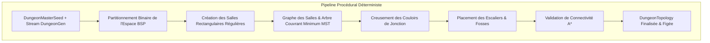

# Spécification Technique 10 — Générateur Procédural de Donjon & Connectivité

| Métadonnée | Valeur |
| :--- | :--- |
| **Identifiant Domaine** | `SPEC-DOMAIN-GEN` |
| **Statut** | Validé / Source Unique de Vérité |
| **Auteur** | Lead Level & Systems Designer |
| **Version** | 1.0.0 |
| **Cible d'implémentation** | `crates/tomb_of_heroes_core` (`topology/`, `rng.rs`) |

---

## 1. Vue d'ensemble & Philosophie Géométrique

Actuellement, l'architecture du donjon repose sur une grille statique de démonstration. Pour garantir une rejouabilité infinie tout en préservant le déterminisme mathématique rigoureux, cette spécification définit l'algorithme de génération procédurale multi-étages.

Tout donjon généré doit respecter le principe de **Connectivité Garantie** :
- Une expédition doit obligatoirement pouvoir naviguer de l'Entrée du donjon (Étage 0) jusqu'au Cœur du Donjon (dernier étage).
- Aucune zone inaccessible ne doit être isolée.
- Les liaisons verticales (Escaliers montants/descendants et Fosses à sens unique) doivent être interconnectées de façon cohérente.



---

## 2. Exigences Spécifiées

### `SPEC-REQ-GEN-001` : Partitionnement Binaire (BSP) & Salles
* **Dimensions d'un étage :** Largeur fixe de $24 \text{ tuiles}$, Hauteur fixe de $24 \text{ tuiles}$ (ou adapté à la configuration).
* **Algorithme BSP :**
  1. La surface de chaque étage est récursivement scindée en sous-rectangles horizontaux ou verticaux (tirage déterministe via stream `DungeonGen`).
  2. Profondeur de découpage : 3 à 4 récursions, garantissant entre 6 et 10 feuilles BSP par étage.
  3. Chaque feuille contient une salle avec marges de sécurité :
     * Largeur $W \in [4, 8]$ tuiles.
     * Hauteur $H \in [4, 8]$ tuiles.
     * Marge minimale de 1 tuile avec les bords de la feuille pour laisser de la roche protectrice (`TileOpacity::Opaque`, `is_passable = false`).

### `SPEC-REQ-GEN-002` : Corridors & Connectivité par Arbre Couvrant (MST)
* **Connexion des salles :**
  1. Chaque salle est identifiée par son centre géométrique $C_i(x_i, y_i)$.
  2. Un graphe complet des salles de l'étage est généré avec la distance de Manhattan comme poids d'arête :
     $$d(C_i, C_j) = |x_i - x_j| + |y_i - y_j|$$
  3. L'algorithme de Kruskal ou Prim déterministe extrait l'Arbre Couvrant Minimum (MST), garantissant que chaque salle est reliée sans cycle superflu.
  4. Pour chaque arête du MST, un couloir en "L" (horizontal puis vertical) de largeur 1 tuile est creusé dans la roche.
  5. **Boucles tactiques :** Afin d'offrir des chemins de contournement aux héros et au joueur, 10% à 20% des arêtes rejetées du graphe complet sont réinjectées pour créer des couloirs circulaires.

### `SPEC-REQ-GEN-003` : Hiérarchie des Étages & Topologie Verticale
Le donjon standard comprend 3 étages superposés :

```
Étage 0 : La Crypte des Entrées
   └── Spawn Héros (X=1, Y=1) ──[Salles & Pièges]──► Escalier Descendant (StairsDown)
                                                              │
                                                              ▼
Étage 1 : Le Labyrinthe des Sépultures
   ┌──────────────────────────────────────────────────────────┘
   └── Escalier Montant (StairsUp) ──[Couloirs Mortels]──► Escalier Descendant
                                                              │
                                                              ▼
Étage 2 : Le Sanctuaire du Cœur
   ┌───────────────────────────────┘
   └── Escalier Montant ──[Périmètre Défensif]──► CŒUR DU DONJON (Objectif Majeur)
```

* **Liens Verticaux (`VerticalLink`) :**
  * Si un `StairsDown` est placé à $(x, y)$ sur l'étage $F$, un `StairsUp` correspondant est placé à la même coordonnée $(x, y)$ sur l'étage $F+1$.
  * Les fosses (`Pitfall`) sont creusées au-dessus de salles libres de l'étage inférieur, permettant une chute à sens unique.

### `SPEC-REQ-GEN-004` : Validation Automatique de Navigabilité (Sanity Check A*)
Avant de valider et de retourner une topologie générée :
1. Une recherche de chemin A* est exécutée entre le point d'apparition des héros à l'étage 0 et la case cible du Cœur du Donjon à l'étage 2.
2. Si aucun chemin continu n'est trouvé, la tentative est immédiatement rejetée et régénérée avec une dérivation de graine déterministe :
   $$\text{Seed}' = \text{Seed} \oplus \text{0x517cc1b727220a95}$$
3. L'invariant de constructibilité impose une terminaison garantie en $\le 5$ tentatives.

---

## 3. Matrice de Traçabilité & Tests TDD

| Réf Exigence | Type Test | Scénario de Validation | Résultat Attendu |
| :--- | :--- | :--- | :--- |
| `SPEC-REQ-GEN-001` | Unitaire BSP | Découpage d'un étage 24x24 | Salles de dimensions valides sans collision de bord |
| `SPEC-REQ-GEN-002` | Unitaire Graphe | Connectivité des salles par couloirs | Toutes les salles appartiennent au même composant connexe |
| `SPEC-REQ-GEN-003` | Unitaire Liens | Cohérence des escaliers inter-étages | Coordonnées de transition superposées et fonctionnelles |
| `SPEC-REQ-GEN-004` | Intégration | Test A* traversant du spawn au Cœur | Chemin continu et valide trouvé sur les 3 étages |
