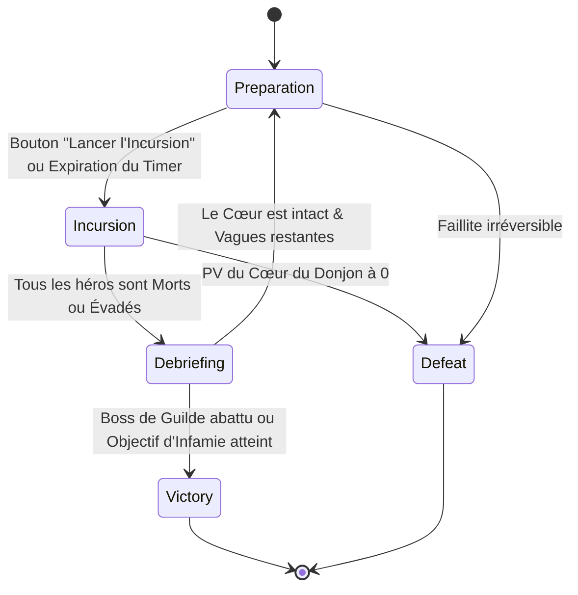

# Spécification Technique 11 — Vagues, Menace de Guilde & Victoire/Défaite

| Métadonnée | Valeur |
| :--- | :--- |
| **Identifiant Domaine** | `SPEC-DOMAIN-WAVE` |
| **Statut** | Validé / Source Unique de Vérité |
| **Auteur** | Lead Systems & Game Economy Designer |
| **Version** | 1.0.0 |
| **Cible d'implémentation** | `crates/tomb_of_heroes_core` (`world.rs`, `intel/`, `config.rs`) & `crates/tomb_of_heroes_app` (`ui/`) |

---

## 1. Vue d'ensemble & Boucle de Jeu Complète

La boucle de gameplay globale de *Tomb of Heroes* s'articule autour d'une confrontation asymétrique par vagues successives entre le joueur (Maître du Donjon nécromancien) et la Guilde des Aventuriers de la surface.

Chaque session de jeu est découpée en **Cycles d'Incursion** successifs :
1. **Phase de Préparation :** Le donjon est au calme. Le joueur fortifie ses défenses, agence ses pièges, relève les corps de la vague précédente en gardiens morts-vivants.
2. **Phase d'Assaut :** L'incursion pénètre dans le donjon. Les systèmes de combat, de terreur et d'exploration s'activent en temps réel.
3. **Phase de Débriefing :** Évaluation des pertes, calcul de l'infamie, enregistrement des renseignements par la Guilde et montée en alerte.

---

## 2. Exigences Spécifiées

### `SPEC-REQ-WAVE-001` : Structure Tri-Phase du Cycle de Jeu
* **Phase 1 : Préparation (`WavePhase::Preparation`)** :
  * Durée : Libre (déclenchement manuel via bouton HUD) ou chronométrée (600 ticks / 30 sec par défaut).
  * Régénération passive : $+1 \text{ Mana}$ tous les $10 \text{ ticks}$ ($0,5 \text{ sec}$).
  * Aucune présence hostile vivante dans le donjon.
* **Phase 2 : Incursion (`WavePhase::Incursion`)** :
  * Déclenchée dès que l'expédition franchit le portail de surface à l'étage 0.
  * L'horloge de combat tourne jusqu'à la résolution complète :
    $$\text{Héros vivants dans le donjon} == 0$$
* **Phase 3 : Débriefing (`WavePhase::Debriefing`)** :
  * Bilan de l'assaut : cadavres récoltés, pièges déclenchés, héros enfuis.
  * Mise à jour du niveau d'alerte de guilde (`AlertLevel`).

### `SPEC-REQ-WAVE-002` : Directeur de Menace & Composition des Vagues
La difficulté et la composition des expéditions de la Guilde sont régies par l'algorithme déterministe du *Threat Director* :

| Vague | Taille Expédition | Classes Présentes | Niveau Moyen | Menace Particulière |
| :--- | :--- | :--- | :--- | :--- |
| **Vague 1 : Novices** | 3 héros | Guerrier, Roublard, Clerc | Niveau 1 | Faible bravoure (panique rapide) |
| **Vague 2 : Aventuriers** | 4 héros | Guerrier, Roublard, Clerc, Mage | Niveau 2 | Détection active des pièges |
| **Vague 3 : Vétérans** | 4 héros | Paladin, Roublard, Clerc, Mage | Niveau 3 | Résistance terreur accrue, réapparition des rescapés |
| **Vague 4 : Élite** | 5 héros | 2 Guerriers, 1 Roublard, 1 Clerc, 1 Mage | Niveau 4 | Tactiques de contournement des cadavres |
| **Vague 5 : Grande Expédition** | 6 héros (Boss) | Grand Maître de Guilde + Élite | Niveau 5 (Boss) | Immunité panique aveugle, auras de bravoure |

* **Intégration des Vétérans Rescapés :**
  * Si un héros a réussi à fuir lors d'une vague antérieure ($V_n$), il est réinjecté prioritairement dans l'expédition de la vague suivante ($V_{n+1}$).
  * Ses traits psychologiques acquis (spécifiés dans `04_fuite_renseignement_veterance.md`) modifient son comportement en jeu (ex. fuite précipitée à proximité du feu ou méfiance extrême sur les dalles).

### `SPEC-REQ-WAVE-003` : Le Cœur du Donjon & Conditions de Défaite
* **L'Entité Sanctuaire (`DungeonHeart`) :**
  * Situé dans la chambre finale de l'étage 2.
  * Points de vie initiaux : $500 \text{ PV}$.
  * Réduction d'armure : $0 \text{ BPS}$.
* **Assaut sur le Cœur :**
  * Tout héros en état d'exploration (`Infiltrating`) atteignant la salle du Cœur s'arrête et commence à canaliser une attaque destructive infligeant $10 \text{ Dégâts/sec}$ au Cœur.
* **Condition de Défaite Absolue :**
  $$\text{PV}(\text{DungeonHeart}) \le 0 \quad \Longrightarrow \quad \text{Défaite Immédiate (GameOver)}$$

### `SPEC-REQ-WAVE-004` : Conditions de Victoire & Progression d'Infamie
* **Victoire de Campagne :**
  * Le joueur remporte la partie si :
    1. L'Expédition de la Vague 5 (Grande Expédition) est intégralement neutralisée (tous les membres tués ou mis en déroute).
    2. OU l'Infamie du joueur atteint le seuil critique de $1\,000 \text{ points}$ (le donjon devient une légende terrifiante intouchable).
* **Calcul de l'Infamie :**
  $$\text{Infamie}_{\text{vague}} = (\text{Héros tués} \times 50) + (\text{Morts par Panique} \times 25) - (\text{Héros Évadés Indemnes} \times 30)$$

### `SPEC-REQ-WAVE-005` : Écran Récapitulatif & Interface de Fin de Partie
* À l'issue d'une partie (Victoire ou Défaite), le conteneur applicatif affiche un panneau modal interactif récapitulant :
  * Nombre total de vagues repoussées.
  * Nombre total de héros terrifiés et abattus par classe.
  * Quantité d'essence d'âme récoltée et cadavres convertis.
  * Nombre de rembobinages chronomantiques effectués et paradoxe total accumulé.
  * Bouton tactile $\ge 44 \times 44 \text{ pt}$ pour relancer une nouvelle partie (génération d'une nouvelle graine maîtresse déterministe) ou exporter la sauvegarde en Base64.

---

## 3. Matrice de Traçabilité & Tests TDD

| Réf Exigence | Type Test | Scénario de Validation | Résultat Attendu |
| :--- | :--- | :--- | :--- |
| `SPEC-REQ-WAVE-001` | Intégration | Cycle complet Préparation -> Incursion -> Débriefing | Transitions d'états fluides et compteurs cohérents |
| `SPEC-REQ-WAVE-002` | Unitaire Vagues | Génération de l'expédition vague 3 avec un rescapé vague 2 | Le héros rescapé conserve ses traits et son identité |
| `SPEC-REQ-WAVE-003` | Unitaire Cœur | Héros attaquant le Cœur du Donjon jusqu'à 0 PV | Déclenchement immédiat de l'état de défaite |
| `SPEC-REQ-WAVE-004` | Unitaire Victoire | Destruction complète de la Vague 5 | Déclenchement de l'état de victoire |
| `SPEC-REQ-WAVE-005` | Frontend/HUD | Affichage du modal de fin de partie | Statistiques exactes, bouton de restart fonctionnel |
